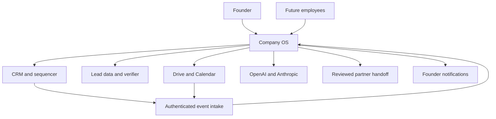

# Part 4 — System Context

The founder sets policies, approves consequential work and owns commercial decisions. Human employees later receive role-limited workspace access. Deterministic workers execute approved commands; AI workers propose language judgments. Partners provide updates and evidence through reviewed imports or established communication channels; V1 grants them no direct platform credentials.

Pipedrive is the commercial authority. Apollo is a licensed data source; its responses are observations requiring provenance. ZeroBounce supplies address validity, not contact permission. Smartlead executes the approved sequence and supplies observed messages/replies. Google Drive owns document bytes; Google Calendar owns scheduled event times and cancellations. OpenAI and Anthropic provide bounded inference. Supabase hosts operational PostgreSQL and managed identity. n8n supplies optional integration plumbing. The bank and ledger remain external and out of implementation scope; finance values require a linked authorised source.

