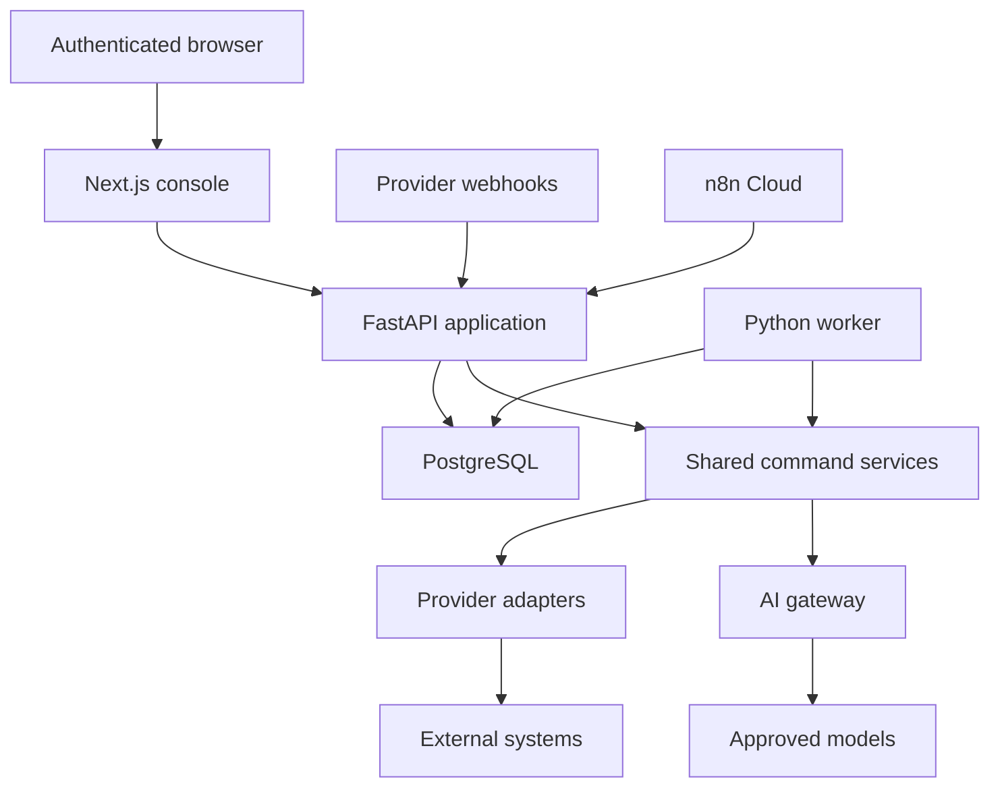
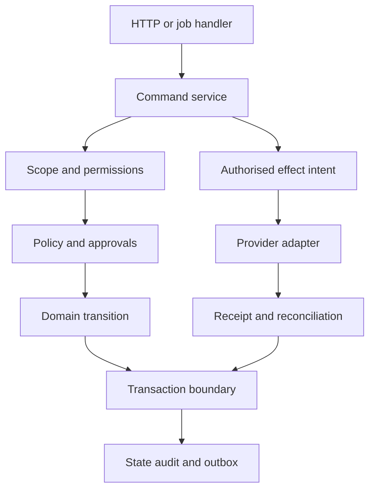

# Part 5 — Container and Component Architecture



The console uses an authenticated server-side session and forwards delegated user identity to the API. It has no database credentials. API and worker load the same Python application package. Dependency injection supplies database and provider adapters; importing a domain module performs no I/O. Background jobs never run as untracked FastAPI background tasks.



A transaction atomically changes local business state, appends audit and creates events. External calls happen after transaction commit, against a persisted effect intent. Never hold a database transaction open while waiting for an AI response or a vendor network request. A short dispatch claim prevents two workers dispatching one effect; uncertain dispatch remains uncertain across restarts.

The backend owns identity, intelligence, prospecting, campaigns, policy, workflow, AI, commercial projections, client operations, knowledge and reporting modules. All cross-module writes use exported command functions. Read models may join authorised tables through a reporting module; write handlers never update another module's tables directly.

# Part 6 — Repository Architecture

Proposed layout, to be created only in Phase 2:

```text
company-os/
  AGENTS.md
  CLAUDE.md
  apps/api/
  apps/worker/
  apps/console/
  packages/company_os/domain/
  packages/company_os/application/
  packages/company_os/policy/
  packages/company_os/workflow/
  packages/company_os/ai/
  packages/company_os/adapters/
  packages/company_os/persistence/
  packages/company_os/reporting/
  packages/contracts/
  database/migrations/
  database/policies/
  database/seeds/
  workflows/n8n/
  tests/unit/
  tests/integration/
  tests/contract/
  tests/security/
  tests/workflow/
  tests/evals/
  tests/e2e/
  docs/
  docs/adr/
  docs/phases/
  infra/
```

| Directory | Owner and responsibility | Allowed dependencies | Prohibited dependencies |
|---|---|---|---|
| apps/api | Platform; HTTP auth, validation, commands, webhook ingress | application, policy, persistence through ports, contracts | UI imports; direct provider effects from routes |
| apps/worker | Platform; lease loop, handler dispatch, heartbeat | workflow, application and configured adapters | Console; alternate policy rules; untracked timers |
| apps/console | Frontend; views and explicit commands | Generated TS API types, auth client, UI components | Python internals, database, provider credentials |
| domain | Backend; pure entities, value types, transitions | Python standard library and shared typed contracts | FastAPI, SQLAlchemy, SDKs, network |
| application | Backend; use cases, transaction orchestration, ports | domain, policy, contracts; interfaces to workflow/AI/adapters | Concrete HTTP vendor clients |
| policy | Security/platform; deterministic checks and authority calculation | domain value types and read ports | LLM, n8n, arbitrary policy scripts |
| workflow | Platform; job contracts and event handlers | application entry points and runtime ports | Direct domain SQL writes outside handlers |
| ai | AI engineering; context, routing, validation, eval metadata | contracts, approved retrieval ports, provider interfaces | Secrets in prompts; permissions administration |
| adapters | Integrations; vendor translation and errors | Provider SDKs, contract ports, shared HTTP client | Other provider adapters; policy override |
| persistence | Data; SQLAlchemy mappings, repositories, RLS session handling | domain/contracts, PostgreSQL driver | UI or vendor network clients |
| reporting | Data/product; authorised projections, metrics and freshness | Read-only persistence ports | Domain state mutation; model-computed arithmetic |
| contracts | API/data owner; JSON Schema and generated OpenAPI/TS snapshots | Schema tooling | Runtime source of independent business rules |
| database | Data; ordered Alembic migrations, reviewed SQL policies, synthetic seeds | Approved schema version | Vendor live data, production secrets, schema auto-create |
| workflows/n8n | Integrations; exported definitions and input contracts | Company OS command API | Send credentials or canonical state |
| tests | QA; fixtures, contract cassettes, adverse scenarios | Target modules and fakes | Production credentials or real prospect recipients |
| docs and ADRs | Technical owner; normative specification, gates and decisions | Stable requirement IDs | Contradictory duplicated rulebooks |
| infra | Platform; deployment definitions after approval | Pinned runtime and environment references | Actual keys or automatic production migration on app boot |

Use a Python workspace/package with one dependency lock and a separate frontend lock. Pydantic models generate the OpenAPI snapshot; TypeScript clients derive from it. CI rejects drift. Alembic is the single migration history. RLS definitions are applied through migrations, not manually in the Supabase console. No second migration system in the frontend.

Documentation mapping: Parts 1–3 → `00-product-overview.md`; 4 → `01-system-context.md`; 5–6 → `02-architecture.md`; 7–8 → `03-domain-model.md`; 9 → `04-data-ownership.md`; 10 → `05-state-machines.md`; 11 → `06-events.md`; 12 → `07-jobs.md`; 13 → `08-policy-approvals.md`; 14 → `09-ai-gateway.md`; 15 → `10-agent-contracts.md`; 16–17 → `11-integrations.md` with a knowledge subsection; 18 → `12-api.md`; 19 → `13-founder-console.md`; 20 → `14-security.md`; 21–22 → `15-observability.md`; 23 → `16-testing.md`; 24 → `17-deployment.md`; 25 → `18-development-workflow.md`; 28–29 → `19-implementation-roadmap.md`; 30 → `20-open-decisions.md`. Part 26 becomes individual ADRs; Part 27 becomes `requirements.md`. `architecture.md`, `domain-model.md`, `security.md` and `testing.md` are short links to these canonical files, not separate copies.

