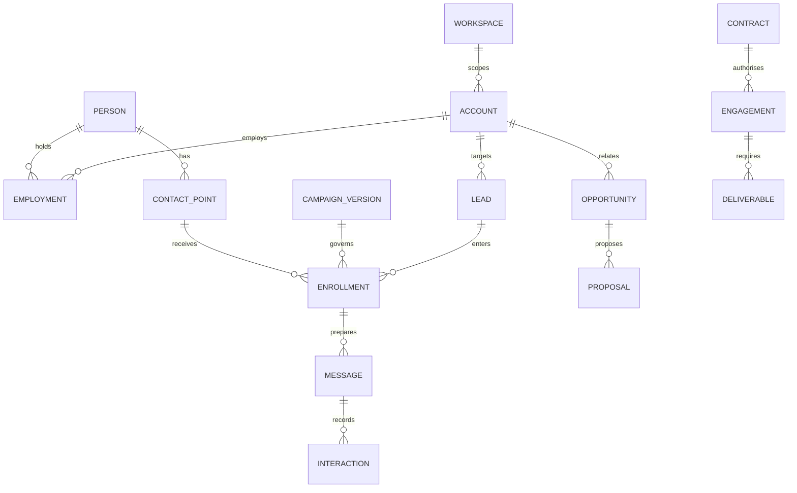

# Part 7 — Domain Model

A workspace is a data and operating-purpose boundary. The company has an `acquisition` workspace and a `partners` workspace. Each client campaign relationship has a `client_delivery` workspace. A client Account in acquisition is linked to a delivery workspace through a restricted relationship directory; no prospects, evidence or threads copy automatically across that link.

An Account is a business identity in one workspace. A Person is a professional identity in that workspace; Employment relates that person to an account over time. A ContactPoint is an address or other contact channel. Lead means an account/offer/ICP prospecting relationship, optionally identifying a target person. It is distinct from a Pipedrive Lead or Deal.

Evidence records a supported observation and its rights. A Signal is an observed event interpreted for relevance, with separate occurrence and observation dates. Score is a versioned deterministic result with missing components preserved. A CampaignVersion freezes targeting, messages, sender and schedule. Enrollment assigns one verified contact to an approved version. Message is a prepared or observed communication; Interaction is an observed event, not an instruction to send.

Opportunity mirrors commercial state from CRM. Proposal stores immutable narrative and pricing references. Contract stores the executed-document reference. Client is a role of an Account. Engagement is the operating scope created from authorised contract and payment conditions. Partner is a role of an Account in the partner workspace; Capability is evidence of what that partner may deliver.

Task is work owned by a human role or service. Job is a technical execution attempt under a durable plan. WorkflowRun coordinates a finite set of jobs and waits. AgentRun records one bounded AI task; ModelRun records each charged model request. These objects are related but not interchangeable.



Suppression is independent of lead stage and wins over every approval. Approval authorises a specific action scope; Policy defines the outer permitted envelope. A Decision records a human judgment even when it does not authorise execution. Event describes something that happened. AuditEntry records who attempted or effected a change, including denied privileged actions. Document points to bytes outside the database. KnowledgeItem identifies an approved document version for a purpose. MetricDefinition and DailySnapshot make reports reproducible.

# Part 8 — Database Specification

## Schema conventions and shared rules

**DATA-001 Common columns.** Unless a row below says global or append-only, every table includes `id uuid PK`, `workspace_id uuid NOT NULL`, `created_at timestamptz NOT NULL`, `updated_at timestamptz NOT NULL`, `record_version bigint NOT NULL DEFAULT 1 CHECK >0`, `schema_version smallint NOT NULL DEFAULT 1`, `created_by uuid NOT NULL FK principals`, `updated_by uuid NOT NULL FK principals`. Database clock supplies timestamps. `UNIQUE(workspace_id,id)` supports composite foreign keys. Workspace is immutable after insertion. Updates require the expected record version. Append-only tables retain id, workspace, created_at, schema_version and created_by; they have no mutable record_version or updated_at.

Notation below: `?` means nullable, all other fields are NOT NULL. `uuid→table` means an FK using `(workspace_id,id)` unless the target is explicitly global. `str` means bounded text (default 500 characters); longer content fields explicitly use `text`. `ts` is timestamptz, `date` is date, `j<T>` is JSONB validated against named schema T; unconstrained JSON is prohibited. `enum(a,b)` is text with a CHECK constraint. Arrays default to empty, never null. Optional fields default to null. Required fields have no implicit business defaults. Immutable configuration versions use append-only rows plus separate activation pointers.

Money is `numeric(20,6)` plus ISO-4217 currency; usage costs use `numeric(20,8)` USD and an explicit rate-card version. Public API money and decimal scores serialize as strings. Counts are bigint ≥0. UTC timestamps use RFC3339 in APIs; schedule zones must be validated IANA zones. Email normalization preserves the original, lowercases the domain, and uses a documented case-insensitive matching key for operational email matching; do not strip plus tags or dots. A person UUID never derives from an email.

Every tenant FK includes workspace. `ON DELETE RESTRICT` is the default. Logical deletion creates a tombstone and queues governed erasure. Append-only audits keep references/hashes without retaining unnecessary personal content. The resource registry provides typed references for heterogeneous tasks and events: every referenced aggregate has exactly one matching `resources` row created in the same transaction, with deferred constraint triggers confirming the typed child exists. The registry is not an EAV store; domain facts remain typed tables. Children and registry entries are erased together under retention rules.

Common indexes: `(workspace_id, updated_at, id)` for mutable aggregates; `(workspace_id, created_at, id)` for append-only records; every composite FK is indexed. Additional indexes and uniqueness rules below are mandatory. Soft-deleted rows are excluded from active-business unique indexes except external IDs, suppression and external-effect keys, which must prevent unsafe resurrection.

**DATA-002 Retention profiles.** R1 raw/unqualified research: 90 days, shorter licence limit wins. R2 active prospect/business records: review at 180 days; retain while authorised use continues, then apply workspace policy. R3 operational runtime/audit metadata: 12 months; ordinary payloads 30 days, redact sooner when appropriate. R4 approved organisational knowledge: until superseded plus documented archive schedule. R5 contract/finance: provisional seven years subject to adviser policy, not a statutory assertion. R6 suppression/erasure tombstones: minimum matching data while needed to prevent prohibited contact/restoration, reviewed annually. R7 identity/access/config: while active plus 12 months of minimal access history. Legal holds suspend applicable erasure but never revive sending permission. No retention duration authorises collecting data in the first place.

Audit classes: A1 create/change/merge/archive with field-diff references; A2 immutable provenance and validation; A3 all commands, decisions, authority and external receipts; A4 read/export/access-change audit for restricted records; A5 projection source/cursor/version and reconciliation outcome. “All” is A1–A5 as applicable. These are application records with DB write restrictions, not a claim that a database administrator cannot tamper.

## Identity and access tables

| ID and table | Purpose and typed fields beyond common columns | Constraints and indexes | Owner, lifecycle, retention and audit |
|---|---|---|---|
| DATA-003 `workspaces` | Boundary; global row: `name str`, `kind enum(acquisition,client_delivery,partners)`, `status enum(active,paused,closing,closed)`, `timezone str`, `retention_profile j<RetentionPolicy>`, `region_policy j<RegionPolicy>`, `legal_entity_id uuid?→legal_entities`, `authz_epoch bigint` | Global UUID; unique name only within operating company; index status. No implicit default jurisdiction | Platform; active→paused/closing→closed; R7; All |
| DATA-004 `principals`, `users`, `service_identities` | Global identity. principals: `kind enum(user,service)`, `status enum(active,disabled)`. users: `principal_id uuid UNIQUE`, `auth_subject str UNIQUE`, `display_name str`. services: `principal_id UNIQUE`, `name str UNIQUE`, `token_key_ref str`, `expires_at ts`, `capability_profile str` | Exactly one principal subtype; no passwords or raw tokens; indexes auth_subject and expiry | Managed auth owns credentials; DB owns app identities; active→disabled; R7; A3/A4 |
| DATA-005 `roles`, `role_permissions`, `memberships` | Roles global: `name str UNIQUE`. role_permissions: `role_id`, `permission str`. memberships tenant: `principal_id uuid→principals`, `role_id uuid→roles`, `status enum(active,revoked)`, `expires_at ts?` | Unique role/permission and workspace/principal/role; principal lookup index; permission names closed in code | Policy module; grants/revocation through founder/admin commands; R7; A3/A4 |
| DATA-006 `legal_entities` | Global restricted directory: `display_name str`, `jurisdiction str?`, `registration_reference str?`, `status enum(unconfigured,active,inactive)` | No tax schema or bank credentials; unique internal UUID; index status | Founder; neutral contractual abstraction; R5/R7; A1/A4 |
| DATA-007 `resources` | Tenant aggregate reference: `resource_type enum(ResourceType)`, `deleted_at ts?` | Unique workspace/id/type; child FK plus deferred matching-child check; no caller-chosen resource_type | Platform; create with aggregate, tombstone together; associated retention; A1 |
| DATA-008 `relationship_directory` | Global restricted link: `acquisition_workspace_id uuid`, `client_account_id uuid`, `delivery_workspace_id uuid UNIQUE`, `client_authority_document_id uuid?`, `status enum(active,closed)` | Explicit composite FK to acquisition account; both workspaces verified; no use as generic cross-tenant join | Founder/platform only; authorised creation→closed; R5; A3/A4 |

## Intelligence and prospect tables

| ID and table | Typed fields | Constraints and indexes | Owner, lifecycle, retention and audit |
|---|---|---|---|
| DATA-009 `accounts` | `display_name str`, `legal_name str?`, `primary_domain str?`, `identity_discriminator str`, `parent_id uuid?→accounts`, `country_code char(2)?`, `industry_code str?`, `size_min int?`, `size_max int?`, `status enum(active,identity_hold,merged,archived)`, `merged_into_id uuid?→accounts`, `source_id uuid→data_sources` | Unique `(workspace_id,primary_domain,identity_discriminator)` for nonmerged rows with domain; domain itself nonunique. Size bounds valid; no parent/merge cycles; index domain, status | Identity module; evidence reviewed before conflict changes; R2; A1 |
| DATA-010 `people` | `display_name str`, `given_name str?`, `family_name str?`, `status enum(active,identity_hold,merged,archived)`, `merged_into_id uuid?→people`, `source_id uuid→data_sources` | No name uniqueness; reviewed external mapping or source linkage; index normalized search name | Identity; active/hold/merge/archive; R2; A1 |
| DATA-011 `employments` | `person_id uuid→people`, `account_id uuid→accounts`, `title str`, `start_date date?`, `end_date date?`, `observed_at ts`, `evidence_id uuid→evidence`, `status enum(current,former,uncertain)` | End≥start when both known; unique person/account/title/start with explicit NULL handling; no assumption of only one current employer | Intelligence; uncertain→current→former; R2; A1/A2 |
| DATA-012 `contact_points` | `person_id uuid?→people`, `account_id uuid?→accounts`, `kind enum(email,phone,url)`, `value_original text`, `value_normalized text`, `match_key str`, `status enum(active,invalid,conflicted,archived)`, `source_id uuid→data_sources` | At least one owner; if both, require consistent employment or explicit role-address relationship. Unique workspace/kind/match_key; shared address uses one contact record plus reviewed links, not duplicate sends | Identity; validity status separate from eligibility and suppression; R2; A1/A4 |
| DATA-013 `data_sources` | `name str`, `provider_connection_id uuid?`, `source_type enum(api,public_page,client_import,human)`, `rights_document_id uuid?→documents`, `rights_status enum(pending,approved,expired,revoked)`, `permitted_purposes text[]`, `allowed_fields text[]`, `retention_days int?`, `expires_at ts?`, `policy_version_id uuid?→policy_versions` | Unique workspace/name; approved requires rights evidence and purpose; index rights_status, expires_at | Policy/data ops; pending→approved→expired/revoked; R4; A3 |
| DATA-014 `evidence` | Append-only: `subject_id uuid→resources`, `source_id uuid→data_sources`, `source_url text?`, `provider_record_id str?`, `fact_key str`, `fact_value j<FactValue>`, `excerpt text?`, `document_version_id uuid?→document_versions`, `observed_at ts`, `event_at ts?`, `expires_at ts`, `content_sha256 char(64)`, `entity_match enum(confirmed,uncertain,rejected)`, `fact_kind enum(observed,reported,inferred)`, `supersedes_id uuid?→evidence` | URL or provider ID or document required; expiry≥observed; unique source/subject/fact_key/hash/observed_at; index subject/fact_key/expiry; only confirmed supported observations qualify as outward factual claims | Intelligence; validity derived from expiry/rights/retraction table; R1/R2; A2 |
| DATA-015 `evidence_retractions` | Append-only: `evidence_id uuid→evidence`, `reason str`, `replacement_id uuid?→evidence` | Unique evidence ID; emits invalidation event for dependent scores/messages | Intelligence/QA; one-way retraction; R2; A2/A3 |
| DATA-016 `signals` | `subject_id uuid→resources`, `kind enum(hiring,funding,technology_change,expansion,stated_need,other)`, `event_at ts?`, `observed_at ts`, `expires_at ts`, `evidence_id uuid→evidence`, `relevance_summary text`, `status enum(candidate,accepted,expired,rejected)` | Source-event fingerprint unique; expiry index; observed event and inference fields separate | Intelligence; candidate→accepted/rejected→expired; R2; A1/A2 |
| DATA-017 `icps`, `icp_versions` | icps: `name str`, `active_version_id uuid?`. versions append-only: `icp_id uuid→icps`, `version int`, `criteria j<ICPCriteria>`, `exclusions j<Exclusions>`, `score_policy j<ScorePolicy>`, `content_hash char(64)`, `approved_decision_id uuid?→decisions` | Unique icp/version; activation through approval command; same-workspace version FK. Criteria specify country, industry, size, roles, disqualifiers and required evidence | Strategy/intelligence; draft version→approved pointer→retired pointer; R4; A3 |
| DATA-018 `offers`, `offer_versions` | offers: `name str`, `active_version_id uuid?`. versions append-only: `offer_id uuid→offers`, `version int`, `scope text`, `exclusions text`, `proof_document_ids uuid[]`, `rate_card_document_version_id uuid?`, `capacity_limit int`, `content_hash char(64)` | Unique offer/version; referenced proofs validated and tenant-scoped; final commercial prices require L4 decision | Founder/commercial; draft→activated→superseded; R4; A3 |
| DATA-019 `leads` | `account_id uuid→accounts`, `person_id uuid?→people`, `contact_point_id uuid?→contact_points`, `offer_version_id uuid→offer_versions`, `icp_version_id uuid→icp_versions`, `state enum(discovered,researching,researched,eligible,engaged,qualified,disqualified,archived)`, `reason_code str?`, `latest_score_id uuid?→scores`, `owner_principal_id uuid→principals`, `eligibility_checked_at ts?` | Unique workspace/account/coalesced-person/offer-version/ICP-version for active leads; index state/owner. Requalification creates new assessment, not a send permission | Prospecting; Part 10 transitions; R2; A1/A3 |
| DATA-020 `scores` | Append-only: `subject_id uuid→resources`, `icp_version_id uuid→icp_versions`, `policy_hash char(64)`, `components j<ScoreComponents>`, `known_points numeric(6,2)`, `maximum_known_points numeric(6,2)`, `missing_keys text[]`, `hard_exclusions text[]`, `evidence_ids uuid[]`, `computed_at ts`, `input_hash char(64)` | Unique subject/ICP/policy/input_hash; each component 0..weight or null; total 0..100; never renormalise missing dimensions to inflate score | Deterministic scoring; immutable/superseded; R2; A2 |
| DATA-021 `verifications` | Append-only: `contact_point_id uuid→contact_points`, `provider_connection_id uuid`, `provider_request_id str?`, `status enum(valid,invalid,catch_all,unknown,disposable,role_address,abuse,do_not_mail)`, `raw_status str`, `raw_substatus str?`, `checked_at ts`, `expires_at ts`, `result_hash char(64)` | Unique request ID when present; index contact/checked_at desc. Raw vendor categories map explicitly; unknown never valid | Verification; new result supersedes by observed time; 7-day default freshness; R2; A2/A5 |
| DATA-022 `permission_assessments` | Append-only: `contact_point_id uuid`, `purpose str`, `channel enum(email)`, `region_policy_version_id uuid`, `basis_reference uuid→resources`, `result enum(eligible,ineligible,unknown)`, `reason_codes text[]`, `expires_at ts` | Query contact/purpose/expiry; legal policy configured by authorised human, not inferred from verification | Policy; immutable/expire; R2; A3 |
| DATA-023 `suppressions` | `contact_point_id uuid?`, `contact_hmac str`, `hmac_key_version int`, `scope enum(workspace,sender,controller)`, `sender_identity_id uuid?`, `reason enum(opt_out,complaint,hard_bounce,identity_conflict,manual,privacy)`, `received_at ts`, `source_event_id uuid?`, `state enum(active,review_required,released)`, `released_by_decision_id uuid?` | Index workspace/HMAC/state and sender/HMAC; active suppression not deleted by lead reset; release requires evidenced permission and founder decision | Policy safety; active persists; ambiguous request blocks; R6; A3/A4 |
| DATA-024 `global_suppression_keys` | Global restricted append records: `key_hmac str`, `key_version int`, `scope_id uuid`, `reason_class str`, `active bool`, `decision_ref uuid?`, `created_at ts` | Unique scope/key/version; not searchable through ordinary API; scope must be authorised controller/safety remit | Dedicated matching service; no client attribution returned; R6; A3/A4 |
| DATA-025 `privacy_requests`, `erasure_tombstones`, `identity_merges` | privacy: `subject_id`, `kind enum(access,delete,correct,restrict)`, `state enum(open,review,executing,completed,blocked)`, `due_at ts`, `decision_id?`. tombstone append: `subject_hmac`, `key_version`, `effective_at`, `scope`, `receipt_refs uuid[]`. merge append: `survivor_id`, `retired_id`, `before_document_id`, `decision_id`, `reversed_by_id?` | All tenant-scoped except dedicated protected restore tombstone export. Merge reversal is a compensating record; dependent contacts rechecked before resume | Human privacy owner/identity; R6/R3; All |

**DATA-026 Scoring contract.** Source weights are industry/problem fit 30, economics 20, trigger relevance 20, relevant reachable role 15, freshness 15. Each policy version defines subrules and evidence keys. Unknown earns no positive points but remains null in the component display. Threshold 70 routes to review and 85 indicates priority; neither overrides exclusion, source rights, verification or permission. Examples: no known trigger means trigger component null, not an AI-assigned 20. Scope-specific changes create a new scoring version and require recalculation.

## Campaign, communication and commercial tables

| ID and table | Typed fields | Constraints and indexes | Owner, lifecycle, retention and audit |
|---|---|---|---|
| DATA-027 `sender_identities` | `provider_connection_id uuid`, `mailbox_external_id str`, `display_name str`, `from_address str`, `domain str`, `postal_address_document_id uuid?`, `auth_check j<SenderChecks>`, `health enum(unverified,healthy,paused,blocked)`, `checked_at ts` | Unique connection/mailbox ID; no mailbox passwords; explicit workspace binding; index health | Policy/integration; unverified→healthy/paused/blocked; R7; A3 |
| DATA-028 `campaigns` | `name str`, `current_version_id uuid?`, `state enum(draft,qa,awaiting_approval,approved,scheduled,active,paused,completed,cancelled)`, `desired_execution enum(stopped,running)`, `observed_execution enum(unknown,stopped,running,completed)`, `provider_connection_id uuid?`, `external_campaign_id str?`, `drift_status enum(clear,unknown,detected)` | Unique connection/external ID; index state; state never substitutes for execution observation | Campaign module for definition; provider for observations; Part 10; R2/R3; A3/A5 |
| DATA-029 `campaign_versions` | Append-only: `campaign_id uuid`, `version int`, `icp_version_id uuid`, `offer_version_id uuid`, `sender_id uuid`, `policy_version_id uuid`, `schedule j<SendSchedule>`, `limits j<CampaignLimits>`, `cohort_hash char(64)`, `message_manifest_hash char(64)`, `content_hash char(64)`, `client_authority_document_version_id uuid?` | Unique campaign/version; version content immutable; approved target manifest cannot be live SQL query; limits include new/day, total/day, touches, spend and date range | Campaign/policy; immutable; R3/R4; A3 |
| DATA-030 `campaign_targets` | Append-only: `campaign_version_id uuid`, `lead_id uuid`, `contact_point_id uuid`, `contact_hash char(64)`, `eligibility_snapshot j<EligibilitySnapshot>`, `variant_key str?` | Unique version/contact; contact changes invalidate eligibility snapshot and require reapproval for changed address; indexes lead/contact | Campaign; frozen membership, suppression may remove but never add recipients; R2/R3; A3 |
| DATA-031 `experiments`, `experiment_assignments` | experiments: `campaign_id uuid`, `hypothesis text`, `primary_metric_definition_id uuid`, `window_days int`, `minimum_sample int`, `variants j<Variants>`, `state enum(draft,active,closed)`. assignments append: `experiment_id`, `account_id`, `variant_key`, `seed_version str` | Unique experiment/account; randomise by account, preserve nonresponders; positive sample thresholds; no adaptive copy edits under same version | Analytics/campaign; draft→active→closed; R3; A2/A3 |
| DATA-032 `enrollments` | `campaign_version_id uuid`, `lead_id uuid`, `contact_point_id uuid`, `sender_id uuid`, `state enum(pending,dispatching,active,stop_requested,stopped,completed,failed,uncertain,cancelled)`, `approval_id uuid`, `external_lead_id str?`, `next_due_at ts?`, `stop_reason str?` | Partial unique workspace/contact/channel=email across pending,dispatching,active,stop_requested,uncertain. Uncertain retains the reservation. Unique connection/external lead scoped campaign. Index next_due/state | Campaign module intent/provider execution; Part 10; R2/R3; A3/A5 |
| DATA-033 `messages` | `enrollment_id uuid?`, `campaign_version_id uuid?`, `contact_point_id uuid`, `direction enum(outbound,inbound)`, `step_no int?`, `subject text?`, `body_document_version_id uuid?`, `body_hash char(64)`, `template_version str?`, `claim_manifest j<ClaimManifest>`, `state enum(draft,qa_failed,qa_passed,approved,dispatching,sent,failed,uncertain,cancelled)`, `provider_message_id str?`, `provider_thread_id str?`, `effect_id uuid?` | Unique connection/provider_message_id when present; unique enrollment/step/body_hash for drafts. Sent content immutable; full email body stays in approved document/mail store, restricted derived excerpt allowed | Local draft authority/provider observed send; R2/R3; A2/A3/A5 |
| DATA-034 `interactions` | Append-only: `contact_point_id uuid`, `message_id uuid?`, `enrollment_id uuid?`, `kind enum(sent,accepted,bounced,reply,opt_out,complaint,meeting,manual_note)`, `occurred_at ts`, `received_at ts`, `provider_event_id str?`, `payload_ref uuid?→resources`, `source_hash char(64)` | Unique connection/provider_event_id or adapter fingerprint; indexes contact/time and kind/time; no “inbox delivered” from acceptance | Integration; append-only corrections through new record; R2/R3; A5 |
| DATA-035 `opportunities` | `account_id uuid`, `crm_connection_id uuid`, `crm_deal_id str`, `crm_lead_id str?`, `engine enum(A,B)`, `stage enum(discovery_scheduled,discovery_completed,qualified,scope_confirmed,proposal_sent,negotiation,won,lost)`, `amount numeric?`, `currency char(3)?`, `amount_basis enum(monthly,annual,total_project,unknown)`, `owner_external_id str?`, `next_action text?`, `next_action_at ts?`, `expected_close_date date?`, `loss_reason str?`, `source_updated_at ts`, `synced_at ts`, `sync_state enum(current,stale,conflict)` | Unique connection/deal ID; nonnegative known amount; open accepted deal missing next action is flagged invalid-for-automation, not hidden; index stage/next_action | Pipedrive projection only; Part 10; R2/R5; A5 |
| DATA-036 `meetings` | `calendar_connection_id uuid`, `external_event_id str`, `recurrence_instance_key str?`, `opportunity_id uuid?`, `account_id uuid`, `starts_at ts`, `ends_at ts`, `timezone str`, `status enum(tentative,confirmed,cancelled)`, `attendance enum(unknown,attended,no_show,rescheduled)`, `consent_status enum(not_requested,denied,granted)`, `brief_document_id uuid?`, `source_etag str?`, `synced_at ts` | Unique connection/calendar/event/instance, calendar ID stored in connection resource scope; end>start. Attendees in `meeting_attendees(meeting_id,person_id?,external_address_hash,role)` | Calendar scheduling; human attendance/consent; R2, recordings 30 days; A3/A5 |
| DATA-037 `proposals`, `proposal_versions`, `pricing_worksheets` | proposals: `opportunity_id`, `current_version_id?`, `state enum(draft,review,approved,sent,superseded,accepted,rejected)`. version append: `proposal_id`, `version`, `document_version_id`, `pricing_worksheet_id`, `scope_hash`, `approval_id?`. worksheet append: `rate_card_version_id`, `line_items j<PriceLines>`, `direct_costs numeric`, `price numeric`, `currency`, `margin numeric`, `assumptions text[]`, `human_price_decision_id?` | Unique proposal/version; code calculates amounts; 0≤margin≤1 unless explicitly loss-making approved exception; accepted proposal not automatically executed contract | Commercial preparation; founder price, L3 dispatch, L4 terms/signature; R5; A3 |
| DATA-038 `contracts` | `account_id`, `proposal_version_id?`, `legal_entity_id uuid→legal_entities`, `document_version_id`, `signature_evidence_document_id`, `signed_at ts`, `status enum(pending_verification,executed,terminated)`, `payment_gate enum(deposit_required,approved_credit,none)`, `payment_evidence_document_id?`, `credit_decision_id?` | Executed requires validated final version and human verification; no API to sign; index account/status | Document/signature authority mirrored with human attestation; R5; A3/A5 |
| DATA-039 `clients`, `engagements` | clients: `account_id UNIQUE`, `status enum(prospect,active,former)`. engagements: `client_id`, `contract_id`, `service_start date`, `service_end date?`, `owner_principal_id`, `state enum(pending,onboarding,active,at_risk,paused,closing,closed)`, `scope_document_version_id`, `health_reason str?` | Client delivery workspace contains its own client account; cross-workspace contract reference uses approved restricted directory/share record, never raw FK bypass. End≥start | Client ops; payment/contract gate enforced; R5; A3 |
| DATA-040 `deliverables`, `acceptances` | deliverables: `engagement_id`, `title str`, `criteria text`, `due_at ts`, `state enum(planned,in_progress,submitted,accepted,rejected,cancelled)`, `submission_document_id?`. acceptances append: `deliverable_id`, `decision enum(accept,reject)`, `evidence_document_version_id`, `authorised_reviewer_id`, `reviewed_at ts` | Acceptance requires authorised human; no AI self-acceptance; index due/state | Client ops/QA; R5; A3 |
| DATA-041 `partners`, `capabilities`, `referrals` | partners: `account_id UNIQUE`, `status enum(candidate,qualified,paused,rejected)`. capabilities: `partner_id`, `service str`, `evidence_document_id`, `technical_lead str`, `capacity j<Capacity>`, `pricing_basis str`, `expires_at ts`, `status enum(unverified,verified,expired)`. referrals: `partner_id`, `opportunity_ref uuid`, `disclosure_document_id`, `terms_document_id`, `state enum(proposed,approved,introduced,closed)` | Partner records in partner workspace; referral cross-workspace reference through authorised share object, with minimum permitted data | Partnerships; independent qualification and disclosure; R2/R5; A3 |
| DATA-042 `financial_snapshots` | Append-only: `legal_entity_id`, `as_of ts`, `source_document_version_id`, `source_kind enum(ledger_export,bank_evidence,reviewed_manual)`, `metrics j<FinancialMetrics>`, `reviewed_by uuid`, `completeness enum(complete,partial)` | Null unavailable metrics; no overwrite of ledger; index as_of | Read-only projection from human-approved source; R5; A5 |

## Work, authority, integrations and AI tables

| ID and table | Typed fields | Constraints and indexes | Owner, lifecycle, retention and audit |
|---|---|---|---|
| DATA-043 `tasks` | `type str`, `subject_id uuid`, `owner_principal_id uuid?`, `accountable_role_id uuid`, `state enum(queued,running,waiting_approval,waiting_external,succeeded,failed,cancelled)`, `due_at ts?`, `review_at ts?`, `input_refs uuid[]`, `output_ref uuid?`, `sop_version_id uuid?`, `reason str?` | Waiting requires owner and review_at; exactly one active claimant; index role/state/due | Shared human/service work queue; Part 10; R3; A3 |
| DATA-044 `decisions` | Append-only: `subject_id uuid`, `decision_type str`, `outcome enum(approve,reject,revise,record)`, `summary text`, `alternatives text[]`, `evidence_ids uuid[]`, `decided_by uuid`, `decided_at ts`, `review_at ts?` | Human author for strategic/L4 decisions; cannot substitute for approval token | Founder; immutable; R4/R5; A3 |
| DATA-045 `policies`, `policy_versions` | policies: `name str`, `active_version_id?`. versions append-only: `policy_id`, `version int`, `rules j<PolicyRules>`, `hash`, `effective_at ts`, `expires_at ts`, `approved_decision_id uuid` | Unique policy/version; rules are typed config, not executable code; activation atomically invalidates affected outstanding approvals | Policy; draft/active/superseded via pointer; R4; A3 |
| DATA-046 `approvals` | `action_type str`, `target_id uuid`, `manifest_document_version_id uuid?`, `scope j<ApprovalScope>`, `payload_hash char(64)`, `object_versions j<ObjectVersions>`, `policy_version_id uuid`, `requested_by uuid`, `requested_at ts`, `expires_at ts`, `usage_limit int`, `reserved_uses int`, `consumed_uses int`, `cost_limit numeric`, `state enum(requested,granted,rejected,expired,revoked,consumed,invalidated)`, `approver_id uuid?`, `approved_at ts?`, `mfa_session_ref str?`, `rationale text?` | Counters ≥0 and sum≤usage_limit; granted needs founder identity/time; exact hashes; index state/expiry. Approval is internal authority, not a transferable bearer secret | Policy; Part 10; R3/R5; A3 |
| DATA-047 `approval_uses` | `approval_id`, `effect_id uuid UNIQUE`, `state enum(reserved,consumed,released)`, `reserved_at ts`, `resolved_at ts?` | Unique approval/effect; uncertain external effect keeps reserved use; decrement/increment under approval row lock | Policy; reserve→consume or safe release; R3; A3 |
| DATA-048 `provider_connections` | `provider enum(apollo,zerobounce,smartlead,pipedrive,drive,calendar,openai,anthropic,n8n)`, `external_account_id str`, `credential_ref str`, `allowed_operations text[]`, `resource_scope j<ProviderScope>`, `capability_report_document_id uuid?`, `status enum(unconfigured,testing,enabled,degraded,disabled)`, `quota_config j<QuotaConfig>`, `last_success_at ts?` | Connection bound to one workspace except separately approved non-PII platform services; secret reference only; index provider/status | Integration/security; preflight→enabled→disabled; R7; A3/A4 |
| DATA-049 `external_id_mappings`, `sync_cursors` | mapping: `connection_id`, `external_type str`, `external_id str`, `internal_resource_id uuid`, `mapping_state enum(active,quarantined,retired)`, `source_version str?`. cursor: `connection_id`, `stream str`, `cursor text?`, `window_start ts?`, `last_success_at ts?`, `last_reconciled_at ts?` | Unique connection/type/external ID forever; unique connection/stream. Mapping target type validated; cursor advances only after page applied | Integration; mappings require reviewed correction; R3; A5 |
| DATA-050 `events`, `outbox`, `consumer_receipts`, `webhook_inbox` | events append: envelope Part 11. outbox: `event_id UNIQUE`, `available_at`, `attempts`, `dispatched_at?`. receipts append: `event_id`, `consumer_name`, `consumer_version`. inbox: `connection_id`, `provider_event_key`, `payload_encrypted text?`, `payload_sha256`, `authenticated bool`, `received_at`, `provider_occurred_at?`, `state enum(received,processing,applied,quarantined,ignored)`, `error_code?` | Unique event/consumer-name (version recorded, not included in dedupe key); unique connection/provider-event-key; index pending/available. Inbox payload expires in 30 days; dedupe metadata longer | Runtime; atomic business effects and receipts; R3; A2/A3 |
| DATA-051 `workflow_runs`, `jobs`, `job_attempts`, `job_dependencies`, `schedules` | workflow: `type`, `version`, `subject_id`, `state enum(running,waiting,succeeded,failed,cancelled)`, `deadline_at?`. jobs and attempts: Part 12 complete contract. dependencies: `job_id`, `depends_on_job_id`, `condition enum(succeeded,terminal)`. schedules: `name`, `timezone`, `rule str`, `next_due_at`, `last_emitted_slot?`, `enabled bool` | No dependency cycles; unique schedule/name and schedule/slot job key; ready-job partial index; no jobs blocked while holding a lease | Runtime; Part 12; R3; A3 |
| DATA-052 `external_effects` | `connection_id`, `action_type`, `target_id`, `effect_key str`, `request_hash`, `request_ref uuid`, `approval_id?`, `policy_version_id`, `expected_versions j<ObjectVersions>`, `state enum(prepared,dispatching,confirmed,rejected,uncertain,cancelled)`, `dispatch_started_at?`, `provider_request_id?`, `provider_object_id?`, `receipt_hash?`, `reconcile_after ts?`, `lease_fence bigint` | Unique `(connection_id,effect_key)` independent of job attempts; no replay of uncertain/confirmed; index uncertain/reconcile_after | Effect dispatcher; Part 12; R3, safety identifiers longer than provider replay horizon; A3/A5 |
| DATA-053 `budgets`, `budget_reservations`, `usage_entries`, `quota_buckets` | budget: `period_start`, `period_end`, `category`, `limit_usd`, `reserved_usd`, `spent_usd`, `status enum(active,frozen)`. reservation: `budget_id`, `job_id`, `call_key`, `maximum_usd`, `actual_usd?`, `state enum(reserved,settled,uncertain,released)`. usage append: `reservation_id`, `provider`, `task_type`, `units j<UsageUnits>`, `cost_usd`, `cost_status enum(estimated,confirmed)`, `rate_version`. quota: `connection_id`, `dimension`, `window_start`, `limit_units`, `reserved_units`, `consumed_units` | Unique budget/workspace/category/period; unique reservation/call_key and quota/connection/dimension/window. Atomically reserve workspace and company roll-up cap in consistent lock order. Counts cannot exceed quota | Cost module; no arithmetic by model; R3; A3/A5 |
| DATA-054 `agent_runs`, `model_runs`, `ai_routes`, `ai_evaluations`, `context_packs` | Agent/task/result fields Part 14. model: `agent_run_id`, `provider`, `model_id`, `model_version?`, `prompt_version`, `request_key`, `provider_request_id?`, `input_tokens`, `output_tokens`, `cached_tokens`, `billable_units j<UsageUnits>`, `cost_usd?`, `latency_ms`, `status enum(started,completed,failed,refused,incomplete,uncertain)`. routes: versioned task→provider/model/caps/eval refs. eval: dataset/split/version, metrics, sample_count, promotion decision. context: immutable manifest/hash/ACL epoch/expiry | Unique model request_key; allowed maximum calls enforced; route version immutable. No raw chain-of-thought field. Context evidence FKs tenant checked | AI module; Part 10/14; payload R3 30 days, metadata 12 months; A2/A3 |
| DATA-055 `documents`, `document_versions`, `knowledge_items`, `knowledge_chunks` | document: `connection_id`, `external_file_id`, `title`, `classification enum(public,internal,client_confidential,restricted)`, `permission_epoch bigint`, `state enum(active,revoked,deleted)`. versions append: `document_id`, `provider_revision str?`, `export_sha256`, `media_type`, `byte_count`, `snapshot_file_id`, `observed_at`, `is_final bool`. knowledge: `document_version_id`, `kind enum(strategy,sop,policy,proof,rate_card,template,report)`, `approved_decision_id`, `valid_from`, `review_due_at`, `status enum(approved,stale,revoked)`. chunks: `knowledge_id`, `ordinal`, `text`, `tsvector`, `hash` | Unique connection/file, document/export hash, knowledge/ordinal; FTS GIN index. Chunk ACL derived from document and current membership, never independently broadened | Drive bytes; DB catalogue; R4 and parent retention; A2/A4/A5 |
| DATA-056 `document_grants`, `authorised_shares` | grants: `document_id`, `principal_or_role_id`, `permission enum(read,edit)`, `expires_at?`. shares: `source_workspace_id`, `destination_workspace_id`, `source_resource_id`, `permitted_fields text[]`, `purpose`, `decision_id`, `expires_at`, `state enum(active,revoked)` | Grant cannot exceed provider ACL. Shares live in restricted directory and create an explicit minimal destination copy with provenance; never bypass normal workspace reads | Founder/security; grant/revoke; R7; A3/A4 |
| DATA-057 `metric_definitions`, `daily_snapshots`, `attention_items`, `audit_entries`, `incidents` | metrics append: `key`, `version`, `formula_spec`, `numerator_query_key`, `denominator_query_key?`, `cohort_rule`, `freshness_seconds`, `timezone`, `unit`. snapshots: Part 19. attention: Part 19 plus `state enum(open,snoozed,resolved)`. audit: Part 21. incident: `severity enum(P0,P1,P2)`, `kind`, `state enum(open,contained,recovering,resolved)`, `owner_id`, `opened_at`, `resolved_at?`, `evidence_refs uuid[]` | Unique metric/key/version and workspace/date/snapshot version; dedupe attention by issue fingerprint, never suppress hard incident banner | Reporting/security; snapshots/audit append-only; R3/R5; All |

Arrays containing references in the dictionary are logical API representations. In physical migrations, any evidence, proof, attendee, role or resource list requiring referential integrity becomes a join table with `(workspace_id,parent_id,child_id)` composite FKs and a unique pair. Use JSON only for value objects such as score components and policy parameters. This rule avoids array references that can quietly cross workspaces.

## Tenancy, RLS and database access

**SEC-001** Every tenant table has ENABLE and FORCE ROW LEVEL SECURITY. Runtime roles are neither table owners nor superusers and have no BYPASSRLS. Supabase service keys can bypass RLS; they are not routine API or worker credentials. RLS and SQL grants must both be configured, including views and functions. [Supabase RLS documentation](https://supabase.com/docs/guides/database/postgres/row-level-security).

Use a private application schema excluded from public Data API exposure. Browser clients only use managed Auth. API and worker use a TLS Postgres connection with a least-privileged login. A transaction establishes `app.principal_id`, `app.workspace_id`, `app.authz_epoch` from verified server-side identity, not request body values. RLS requires workspace equality and an active membership/service grant. Set these values using transaction-local settings; connection pools must not retain session context. An absent context denies access. Do not interpolate user-controlled SQL or accept arbitrary filter expressions.

Illustrative policy shape, not a migration:

```sql
USING (
  workspace_id = app.current_workspace_id()
  AND app.has_active_membership(app.current_principal_id(), workspace_id)
)
WITH CHECK (
  workspace_id = app.current_workspace_id()
  AND app.has_active_membership(app.current_principal_id(), workspace_id)
)
```

Membership lookup uses a narrowly granted security-definer function with fixed search_path, no dynamic SQL, minimal return value and explicit principal checks. Tests include table-owner execution, pooled connection reuse, views, joins, exports, event payload references and failed transactions. RLS prevents accidental unscoped access; it is not claimed to defeat a fully compromised trusted API process with access to valid memberships. AI has no DB credential or arbitrary SQL tool.

The scheduler/dispatcher uses a narrow claim function that returns only job ID, workspace, type and lease metadata across authorised service workspaces. It does not retrieve arbitrary business payloads. Processing then opens a scoped transaction. No default all-workspace DB session exists. A separate maintenance identity performs migrations and controlled restores; never use it to serve traffic.

**SEC-002** Global safety matching uses an HMAC with a versioned secret, not a plain email hash vulnerable to dictionary search. Only a purpose-limited policy function can query it. It returns blocked/clear/unknown without revealing source workspace, reason details or whether another client holds the contact. Tenant suppression is default; wider controller/sender/safety scope needs an approved processing policy. Global tables are not readable by ordinary application roles.

**SEC-003** Founder aggregate reporting first enumerates workspaces in which that user has active permission, then fetches approved per-workspace metrics. It does not disable RLS. Client identity and contact data never appear in another client's AI context. Provider subaccounts and Drive ACLs must independently satisfy the same separation.

## Representative constraint contracts

```sql
-- Representative constraints only, not deployable migrations.
FOREIGN KEY (workspace_id, account_id)
  REFERENCES accounts(workspace_id, id);
UNIQUE (connection_id, external_type, external_id);
UNIQUE (connection_id, effect_key);
CHECK (reserved_uses + consumed_uses <= usage_limit);
CHECK (expires_at > requested_at);
```

**DATA-058 Identity merge transaction.** Pause affected enrolments; require founder decision for uncertain matching; lock both records in UUID order; snapshot fields and relationships; move eligible references within the same workspace; preserve external mappings and all historical attribution; mark the retired UUID as a redirect. Never silently reassign a sent message. An incorrect merge is reversed through a reviewed compensating transaction and re-verification, with sends held until every contact/claim is rechecked.

## Closed value-object schemas and implementation clarifications

The following definitions complete the `j<T>` contracts in the dictionary. They are logical schemas; Phase 2+ converts the relevant ones to Pydantic/JSON Schema and tests them. Every object rejects unknown properties. Required properties are listed without `?`. Reference arrays become validated joins where required by DATA-001. Default string length is 500; narrative text is limited to 20,000 characters per field; arrays default to a maximum of 200 items unless an explicit batch contract permits more. Large manifests use document snapshots plus paged target rows, not unbounded JSON.

| Schema | Required shape and constraints |
|---|---|
| ResourceType / ResourceRef | Closed registered aggregate types from DATA-009 onward; ref `{type,id,version}`. Registry maps each type to its table and read permission. Runtime/task infrastructure can reference an aggregate but cannot masquerade as an Account. |
| FactValue / FactClaim | FactValue is tagged `{type: string\|integer\|decimal\|date\|boolean\|unknown, value: corresponding scalar\|null, unit?:string}`; only unknown allows null. FactClaim `{fact_key,value,evidence_ids,kind:observed\|reported\|inferred,summary}`. An inference cannot promote itself into an observed fact. |
| RetentionPolicy / RegionPolicy | Retention `{version,profiles:{R1:days,...},review_owner_role,legal_hold_ref?}`; durations for indefinite reviewed categories use `{mode:review,review_days}`. Region `{version,allowed_processing_regions:strings[],allowed_recipient_countries:ISO2[],channel_policies:[{channel,purpose,policy_document_version_id,expires_at}],cross_border_decision_ref?}`. Empty allowlists mean denied, not all regions. |
| ICPCriteria / Exclusions | Criteria `{industries:strings[],countries:ISO2[],employee_range:{min,max}?,required_problem_fact_keys:strings[],target_roles:strings[],required_evidence_keys:strings[]}`. Exclusions `{account_ids:UUID[],domains:strings[],countries:ISO2[],industry_codes:strings[],reason_rules:[{field,operator:eq\|in\|lt\|gt,value,reason_code}]}`. No executable SQL or expressions. |
| ScorePolicy / ScoreComponents | Policy `{version,weights:{fit:30,economics:20,trigger:20,role:15,freshness:15},review_threshold:70,priority_threshold:85,rubric:[{component,conditions,points,evidence_keys}]}`. Each component `{points:decimal\|null,max_points:decimal,evidence_ids:UUID[],reason_codes:strings[]}`. Conditions use the same closed operator vocabulary; points and sum are checked in code. Missing required evidence yields null. |
| SenderChecks | `{spf:pass\|fail\|unknown,dkim:pass\|fail\|unknown,dmarc:pass\|fail\|unknown,mailbox_mfa_verified:boolean,identity_verified:boolean,reply_monitor_verified:boolean,provider_warning:boolean,checked_at,evidence_refs}`. A stored check is an observation with expiry, not a perpetual certificate. |
| SendSchedule | `{start_at,end_at,sender_timezone:IANA,recipient_timezone_policy_id:UUID,allowed_weekdays:int[],local_windows:[{start:HHMM,end:HHMM}],holiday_calendar_version?:string}`. end_at>start_at, windows cannot cross midnight in V1, weekday 1..7, all follow-ups finish inside approved end_at. Unknown recipient zone blocks scheduling. |
| CampaignLimits | `{max_recipients:int,max_new_per_mailbox_day:int,max_messages_per_mailbox_day:int,max_touches:int,max_spend_usd:decimal,max_verification_age_seconds:int}`. Positive values; cannot exceed active workspace policy; follow-ups count toward total messages. |
| EligibilitySnapshot | `{contact_id,contact_hash,permission_assessment_id,verification_id,score_id,source_rights_version_ids,checked_at,expires_at,reason_codes,suppression_check_version}`. Snapshot is evidence of a past check; live checks still run at release/dispatch. |
| Variants / ClaimManifest | Variants `{primary_dimension:string,choices:[{key,message_template_version,allocation_weight:decimal}],seed_version}`; positive weights sum to 1. ClaimManifest `{claims:[{span_start:int,span_end:int,text_hash,evidence_ids,claim_kind:factual\|approved_general,proof_version_id?}],body_hash,validator_version}`; spans address the exact approved body bytes through documented UTF-8 offset convention. |
| PriceLines / Capacity | PriceLines `[{description,quantity:decimal,unit_price:decimal,currency,discount_amount:decimal,tax_amount:decimal,line_total:decimal}]`; calculations from human-approved inputs, nonnegative quantity, round each line to currency minor units using decimal ROUND_HALF_UP, then sum rounded lines; preserve unrounded inputs. A different approved rate-card convention requires an explicit version. No tax rules inferred. Capacity `{unit:hours\|projects\|clients,available:decimal,period_start,period_end,observed_at,evidence_ref}`. |
| FinancialMetrics | `{cash_by_currency:[{currency,value,source_ref}],receivables_by_currency:[...],mrr_by_currency:[...],excluded_or_unknown:strings[]}`; values decimal strings; source/time mandatory. Snapshot cannot calculate tax/recognition without external authority. |
| PolicyRules | `{version,allowed_actions:ActionEnum[],allowed_provider_operations:[{connection_id,operations}],source_ids:UUID[],allowed_ai_providers:ProviderEnum[],allowed_sensitivity:Classification[],volume_caps:CampaignLimits,budget_ids:UUID[],region_policy:RegionPolicy,approval_defaults:{campaign_hours,reply_hours,export_hours},hard_stop_rules:RuleEnum[]}`. A policy can narrow but cannot disable architectural hard controls. |
| ApprovalScope / ObjectVersions | Scope `{action_type,workspace_id,target_ids,manifest_ref,recipient_hashes,sender_id?,message_hashes,offer_version_id?,icp_version_id?,policy_version_id,schedule?,limits?,connection_ids,source_rights_version_ids,client_authority_ref?,expires_at,usage_limit,cost_limit_usd}`. Optional only when inapplicable to action type. ObjectVersions is `{objects:[{type,id,record_version,content_hash?}]}` with unique type/id. |
| ProviderScope / QuotaConfig | Scope `{external_account_id,allowed_resource_ids:strings[],workspace_binding_id,permitted_operations:strings[]}`; no wildcard by default. Quota `{limits:[{dimension:requests\|credits\|messages\|tokens,window_seconds:int,maximum:int,reserve_for_safety:int}],verified_at,capability_report_id}`. Unknown limit does not become infinity. |
| UsageUnits | `{requests:int,input_tokens:int,output_tokens:int,cached_tokens:int,reasoning_tokens:int,search_calls:int,enrichment_credits:decimal,verification_credits:decimal,workflow_executions:int,storage_bytes:int}`; counters ≥0, irrelevant counters zero. Provider billing categories may be added only through versioned schema. |
| JobState / ActionEnum / RuleEnum | JobState is queued, leased, running, retry_wait, waiting_approval, waiting_external, cancel_requested, succeeded, dead_letter, cancelled. ActionEnum is the closed set of command names in API-005 onward; no dynamic vendor method names. RuleEnum enumerates suppression, tenant, rights, version, expiry, budget, volume, provider_health, claim_support, source_freshness, human_only and environment_containment. |
| AllowedIdentityFields | Account: display_name, legal_name, primary_domain, country_code, industry_code, size_min, size_max, parent_id. Person: display_name, given_name, family_name. Contact value change creates a replacement ContactPoint and invalidates affected authority; no update-in-place of the address attached to sent history. |
| AI role result common types | EvidenceClaim `{text,evidence_ids,kind}`; Defect `{rule_id,severity:critical\|major\|minor,reason,subject_ref,evidence_refs}`; ToolCapability `{name,operation,resource_ids,max_calls}`; ProposedAction `{command_type,target_id,payload_summary,required_authority,evidence_refs}`. ProposedAction never contains an executable token or credential. |

**Initial scoring rubric.** Require a founder-approved workspace rubric before production qualification. A useful synthetic fixture gives fit 30 only when required industry and problem evidence match; economics 20 only when explicit configured deal-capacity evidence matches; trigger 20 for an accepted relevant unexpired signal; role 15 for a matched target role and valid professional contact; freshness 15 when all required evidence is current. A confirmed mismatch scores 0 and may hard-exclude; missing evidence is null. Partial points are permitted only when a versioned rule explicitly defines them. This binary fixture is for verifying arithmetic and missingness, not evidence that these weights predict sales. The founder-approved production rubric may refine conditions without changing schema.

**Subtype and reference integrity.** Tables that represent versions have explicit integer `version` plus parent FK and unique parent/version; active-version pointers require same-workspace and same-parent checks. `created_by`/owner user links use global principals with an active workspace membership checked by command and DB helper. Global LegalEntity references do not grant document access. `provider_connection_id` is mandatory on provider-derived Message/Interaction/Verification records even where omitted from a short field list above; provider IDs are always namespaced by connection. Meetings also store `external_calendar_id str` so event keys remain unique across calendars. ModelRun numeric cost may be null only while estimated/uncertain, with the reservation retained.

**Human authority evidence.** A client-owned signed contract or client approval can be represented inside its delivery workspace by a permitted immutable document copy/metadata reference with an authorised share record. This explicitly avoids a cross-workspace FK pretending to be ordinary tenant data. The copy retains source ID/hash and permitted purpose; revocation invalidates downstream use. No other client's prospects become part of that share.


