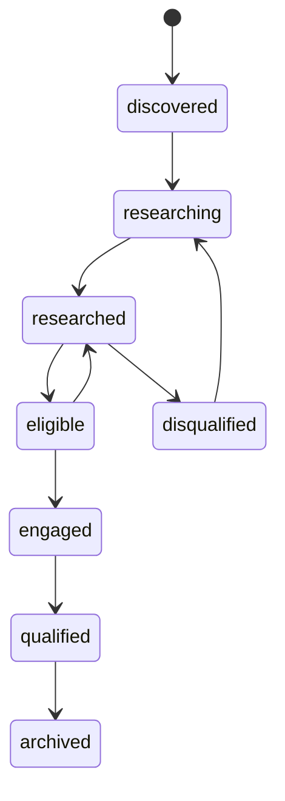
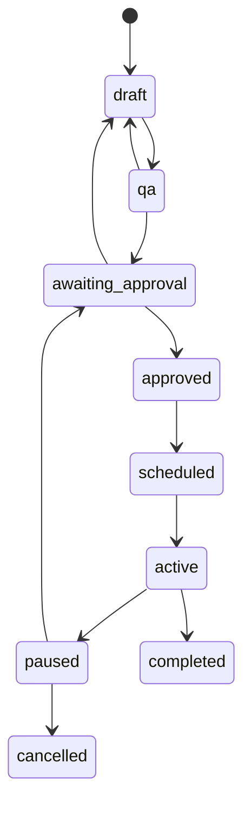

# Part 10 — State Machines

Every transition checks workspace, role, expected version and invariants, then writes state, audit and outbox atomically. Invalid transitions return `409 INVALID_TRANSITION` without partial mutation. A row listing several origins permits the same specified transition from each origin. “Compensate” means a new recorded action; it never deletes history. Provider-dependent failure leaves desired and observed states distinct.

## Leads

Campaign approval and execution are removed from the Lead enum because one lead may have several historical campaigns. Suppression is an independent blocking overlay displayed on the lead. The console may derive “approved for Campaign 3” or “active in Campaign 3” from enrolments; it must not create a competing lead stage.

| Transition | Trigger and actor | Preconditions | Event / level | Reverse and failure |
|---|---|---|---|---|
| discovered→researching | Research job claim; service | Approved source, budget, identity clear | account.research_requested / L1 | Cancel back to discovered; provider outage keeps job pending |
| researching→researched | Validated research; service | Required evidence fields present or explicitly unknown | account.research_completed / L1 | New evidence creates new run; hard conflict→identity hold |
| researched→eligible | Eligibility command; code | Score policy met, no exclusions, valid permission and contact verification | lead.eligible / L1 | Eligibility expiry→researched; failure stays researched |
| eligible→researched | Expiry/rights/identity change; code | Relevant evidence or permission no longer current | lead.eligibility_revoked / L1 | Re-evaluate; stop affected enrolments |
| eligible/researched→engaged | Observed human reply; service | Identity/thread resolved; no sales-positive inference required | lead.engaged / L1 | No automatic backward move; suppression still applies |
| engaged→qualified | Founder accepts qualification | Need, fit, buyer process and dated next step evidenced | lead.qualified / L3 | Correction through decision; CRM creation is separate effect |
| discovered/researched/eligible/engaged→disqualified | Deterministic exclusion or founder decision | Reason code and evidence | lead.disqualified / L1 internal or L3 human judgment | Reopen→researching only with new evidence; do not remove suppression |
| disqualified→researching | Founder requests reassessment | Reason superseded, rights valid | lead.reassessment_requested / L1 | Failure retains disqualification history |
| Any nonarchived→archived | Closure/retention command | Active enrolments stopped; minimal records retained | lead.archived / L1 | Restore requires fresh eligibility; erased PII cannot be restored |

## Campaigns

| Transition | Trigger/actor | Preconditions | Event / level | Reverse/failure |
|---|---|---|---|---|
| draft→qa | Prepare command; researcher/SDR | Frozen candidate version, rights, offer and ICP versions | campaign.qa_requested / L1 | Validation failure→draft with defects |
| qa→awaiting_approval | QA completion; code | Claims, identity, schedule, samples and manifest pass | campaign.approval_requested / L1 | Missing support→draft |
| awaiting_approval→approved | Founder grant | Exact manifest, MFA, client authority if applicable, funded cap | campaign.approved / L3 | Revocation/expiry→paused; rejection/revision→draft |
| approved→scheduled | Release command; service | Current approval, provider preflight, no drift, eligible cohort | campaign.scheduled / L2 | Uncertain deployment→paused with effect uncertain |
| scheduled→active | Provider activation confirmed | All release checks current; correct provider version | campaign.activated / L2 | Cannot claim active from local request alone |
| scheduled/active/approved→paused | Protective stop or founder pause | Reason recorded; no approval needed to reduce harm | campaign.pause_requested / L1 | Observed provider pause tracked separately; failure escalates |
| paused→awaiting_approval | Resume request; founder/operator | Incident resolved; current cohort/content/rights rechecked | campaign.resume_requested / L3 | New approval required in V1; no auto-resume |
| active→completed | Provider/history reconciliation | All enrolments terminal and no uncertain effects | campaign.completed / L1 observation | Correction is explicit, never silently resume |
| draft/qa/awaiting_approval/approved/scheduled/active/paused→cancelled | Founder cancel or closure policy | Stops requested for any active enrolments | campaign.cancelled / L1 protective | Terminal; create new campaign for restart; incomplete provider stops remain incident |
| Any editable state→draft new version | Material edit; operator | Prior version retained, approval invalidated; active sending paused | campaign.version_created / L1 | New QA and L3 approval; no old approval reuse |

## Other lifecycles

| Object and transition | Trigger/actor and required conditions | Event / authority | Reversal and failure |
|---|---|---|---|
| Enrollment absent→pending | Approved frozen target release; service; contact unique, eligible, unsuppressed | enrollment.created / L2 | Cancel while no effect; constraint conflict denies |
| pending→dispatching | Effect claim; worker; authority/budget current | enrollment.dispatch_started / L2 | No arbitrary retry after dispatch begins |
| dispatching→active | Provider enrolment confirmed and matched | enrollment.activated / L2 | Receipt conflict→uncertain |
| dispatching→uncertain | Timeout/crash after possible provider accept | effect.uncertain / L1 | Read-only reconciliation; never blind reenrolment |
| pending/active/dispatching/uncertain→stop_requested | Reply, opt-out, bounce, meeting, pause; code | enrollment.stop_requested / L1 | Immediately locally blocked; priority provider stop |
| stop_requested→stopped | Provider confirms no further sequence execution | enrollment.stopped / L1 | Resume requires fresh approval and reconciled provider state |
| active→completed | Last touch confirmed, no pending or uncertain effect | enrollment.completed / L1 | No automatic restart |
| pending→cancelled; dispatching→failed | Cancel before dispatch; or definitive provider rejection | enrollment.cancelled or enrollment.failed / L1 | New reviewed intent only; uncertain is not failed |
| uncertain→active/stopped/failed | Reconciliation proves actual result | effect.reconciled / L1 | Mapping conflict quarantines; retain evidence |
| Opportunity absent→discovery_scheduled | Founder CRM create; confirmed meeting | opportunity.created / L3 | Async command; DB projection awaits CRM |
| discovery_scheduled→discovery_completed | Founder CRM update; attendance and notes | opportunity.stage_changed / L3 | Reschedule can return to scheduled with reason |
| discovery_completed→qualified | Founder; fit, need, buying process, next step | opportunity.stage_changed / L3 | Disqualify→lost with reason |
| qualified→scope_confirmed | Founder; feasible scoped delivery and pricing worksheet | opportunity.stage_changed / L3 | Reopen discovery with explicit reason |
| scope_confirmed→proposal_sent | Provider/human dispatch evidence for approved proposal | opportunity.stage_changed / L3 | Revision retains sent history |
| proposal_sent→negotiation | Founder; actual buyer discussion | opportunity.stage_changed / L3 | Return to scope_confirmed for material revision |
| qualified/scope_confirmed/proposal_sent/negotiation→won | Founder; executed agreement evidence | opportunity.won / L4 human decision | Correction needs founder record; no automatic onboarding |
| Any open deal→lost | Founder; buyer reason or clearly labelled internal interpretation | opportunity.lost / L3 | Reopen only by founder with new next step |
| Job queued/retry_wait→leased→running | Worker claim/start; ready, dependencies met, budget available | job.started / L1 | Lease expiry governed below |
| running→succeeded | Handler commit with current fence | job.succeeded / L1 | Immutable attempt; stale fence rejected |
| running→retry_wait/dead_letter | Typed transient error within cap / cap exceeded | job.retry_scheduled or job.failed / L1 | Dead letter retry requires reviewed new attempt |
| running→waiting_approval/waiting_external | Durable dependency registered | job.waiting / L1 | Release lease; callback/schedule→queued |
| queued/retry_wait/waiting_*→cancelled | Founder, expiry or parent cancellation | job.cancelled / L1 | New job needed; no effect replay |
| running→cancel_requested→cancelled | Cooperative cancellation; worker reaches safe boundary | job.cancelled / L1 | Started external effect reconciled regardless |
| Approval requested→granted/rejected | Founder with fresh MFA; exact immutable scope | approval.granted/rejected / L3 or recorded L4 decision | Revocation possible before execution |
| granted→consumed | All allowed uses confirmed consumed | approval.consumed / L1 accounting | Never reopen by editing counters |
| requested/granted→expired | Clock reaches expiry | approval.expired / L1 | New approval required |
| requested/granted→invalidated | Material version/policy/target change | approval.invalidated / L1 | New scope/new approval |
| granted→revoked | Founder or security authority | approval.revoked / L1 protective | Cancel pending effects and stop provider execution |
| AgentRun queued→running→validating | Worker and allowed route; bounded context/budget | agent.started / L1 | Provider failure→retry_wait via job |
| validating→accepted | Schema, evidence, policy and semantic validators pass | agent.output_created / L1 | Accepted proposal still not authority to send |
| validating→quarantined | Unsupported claims, access or semantic failure | agent.output_quarantined / L1 | Human correction/new version only |
| running/validating→failed/cancelled | Exhausted repair/retry or revoked context | agent.failed/cancelled / L1 | New run preserves prior failure |
| Engagement pending→onboarding | Founder confirms contract and payment/credit gate | engagement.onboarding_started / L2 under recorded scope | Missing gate stays pending |
| onboarding→active | Access checklist and client readiness accepted | engagement.activated / L3 | Failure remains onboarding |
| active→at_risk | Evidence-backed delivery warning; code/human | engagement.risk_detected / L1 | Human resolution→active |
| active/at_risk→paused | Founder or protective stop | engagement.paused / L1 | Resume requires current scope and founder approval |
| active/at_risk/paused→closing→closed | Founder closure plan; handoff/revocation/retention receipts | engagement.closing/closed / L3 | Unresolved deletion/export task blocks closed |
| Task queued→running | Authorised human/service claim | task.claimed / L1 | Owner expiry/release→queued |
| running→waiting_approval/waiting_external | Missing authority/input; review date and owner mandatory | task.waiting / L1 | Explicit dependency resolution→queued |
| running→succeeded/failed/cancelled | Validated output/failure/cancellation | task.completed / L1 | Acceptance-sensitive work requires separate human acceptance |

Messages follow draft→qa_passed or qa_failed→approved→dispatching→sent/failed/uncertain. The same campaign manifest authorises its frozen messages; a substantive reply needs its own exact-content approval. Provider status `accepted` is recorded as an Interaction and does not mean inbox delivery. No sent message is editable.

