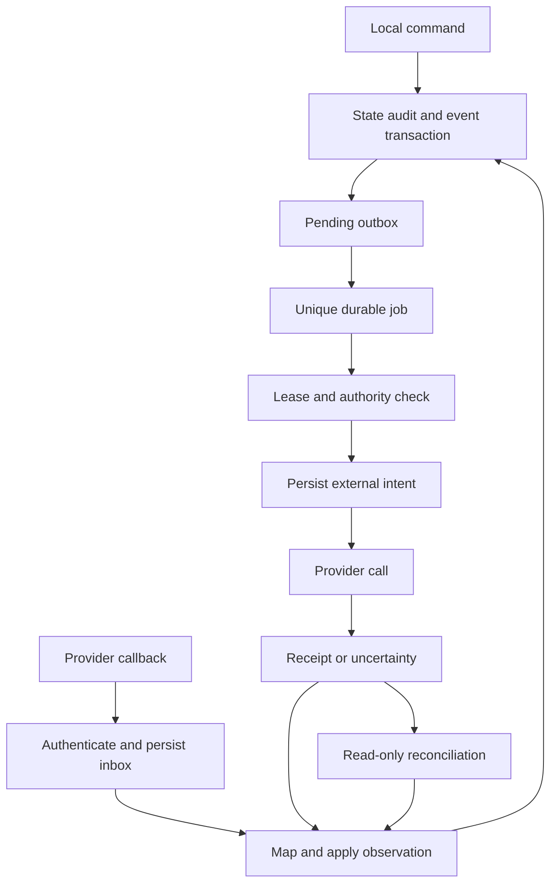

# Part 11 — Event Architecture

**EVT-001 Envelope v1** is a closed JSON object:

```json
{
  "event_id": "uuid",
  "event_type": "campaign.approved",
  "schema_version": 1,
  "workspace_id": "uuid",
  "aggregate_type": "campaign",
  "aggregate_id": "uuid",
  "aggregate_version": 3,
  "occurred_at": "2026-09-16T03:00:00Z",
  "received_at": "2026-09-16T03:00:00Z",
  "actor": {"type": "user", "id": "uuid"},
  "causation_id": "uuid-or-null",
  "correlation_id": "uuid",
  "origin": "company_os",
  "payload": {"campaign_version_id": "uuid", "approval_id": "uuid", "manifest_hash": "sha256"},
  "payload_ref": null,
  "classification": "internal",
  "trace_id": "opaque-string"
}
```

UUID/date placeholders above illustrate types, not valid production values. `payload` contains bounded IDs and non-sensitive values only, ≤16 KiB. A restricted `payload_ref` points to a same-workspace resource. Event type, schema version and aggregate type must match the registry. Unknown versions quarantine rather than best-effort deserialize. Causation identifies the event/command responsible; correlation groups the business workflow. The database creates aggregate versions under row lock. Vendor timestamps never determine local authority.

**EVT-002 Delivery contract.** Events are immutable facts. Consumer delivery is at least once. `UNIQUE(event_id,consumer_name)` prevents duplicate committed consumption; updating consumer code does not automatically replay historical effects. An intentional projection rebuild uses a separate replay namespace and disables all external effects. Handler state changes and consumer receipt commit together. An outbox row is marked dispatched only after dependent jobs/receipts are durably registered.

All event registry rows below inherit envelope fields and A3 audit. Payload fields are required unless `?`; IDs resolve inside the event workspace. Dedupe **A** = aggregate UUID/version/type; **P** = connection/provider event ID or versioned fingerprint; **S** = schedule/local date/slot; **E** = persisted effect key. Consumers never infer authority from the existence of an event.

| ID and event type | Producer → consumers | Payload v1 | Dedupe; side effect and audit implication |
|---|---|---|---|
| EVT-003 account.created | Identity→research planning | account_id, source_id | A; internal task only |
| EVT-004 account.research_requested | Research→job runtime | account_id, icp_version_id, source_ids | A; scoped data fetch with cost reservation |
| EVT-005 account.research_completed | Research→score/console | account_id, evidence_ids, missing_keys | A; calculate score; facts retain provenance |
| EVT-006 account.score_calculated | Score→eligibility/metrics | score_id, lead_id?, policy_hash | A; no send permission |
| EVT-007 evidence.retracted / evidence.expired | Evidence→QA/policy | evidence_id, reason | A; invalidate dependent drafts/eligibility; protective stop if material |
| EVT-008 contact.verified | Verifier→eligibility | verification_id, contact_id, status, expires_at | P; no consent inference |
| EVT-009 lead.eligible / lead.eligibility_revoked | Policy→campaign/tasks | lead_id, assessment_id, reason_codes | A; prepare or halt; audit rule version |
| EVT-010 lead.engaged / lead.qualified / lead.disqualified / lead.archived / lead.reassessment_requested | Prospecting→sales/metrics | lead_id, evidence_refs, reason_code? | A; qualified can propose CRM effect, never auto-win |
| EVT-011 campaign.version_created / campaign.qa_requested | Campaign→QA | campaign_id, version_id, hash | A; prior approval invalidation |
| EVT-012 campaign.approval_requested | QA→approvals/attention | version_id, qa_result_id, manifest_ref | A; no provider call |
| EVT-013 campaign.approved | Approval→release planning | version_id, approval_id, manifest_hash | A; queue future revalidated release |
| EVT-014 campaign.scheduled / campaign.activated | Sequencer adapter→console | version_id, connection_id, external_campaign_id, observed_at | E/P; verified provider state only |
| EVT-015 campaign.pause_requested / campaign.cancelled | Policy/founder→safety dispatcher | campaign_id, reason, incident_id? | A; stop/pause effect, high priority |
| EVT-016 campaign.resume_requested / campaign.completed | Campaign→approval or metrics | campaign_id, version_id, evidence_refs | A; resume needs new approval, completion no send |
| EVT-017 enrollment.created / enrollment.dispatch_started / enrollment.activated | Campaign/adapter→runtime/metrics | enrollment_id, version_id, effect_id? | A/E; persisted single-owner execution |
| EVT-018 enrollment.stop_requested / enrollment.stopped | Safety/adapter→health | enrollment_id, suppression_id?, reason, provider_receipt_ref? | A/E; stopped requires provider confirmation |
| EVT-019 enrollment.completed / enrollment.failed / enrollment.cancelled | Adapter/runtime→reporting | enrollment_id, reason?, receipt_ref? | A/P; uncertain never labelled failed |
| EVT-020 message.sent / message.failed / message.accepted / message.bounced | Sequencer→interactions/metrics/safety | message_id, enrollment_id, provider_message_id, occurred_at, failure_code? | P; bounce may suppress; no resend consumer |
| EVT-021 reply.received | Authenticated intake→stop then classifier/tasks | interaction_id, contact_id, enrollment_id?, thread_ref | P; persist local hold before AI job creation |
| EVT-022 suppression.created / suppression.propagated / suppression.propagation_failed | Policy/adapter→safety/attention | suppression_id, contact_id?, connection_id, receipt_ref? | A/E; deny takes effect immediately; failed propagation remains incident |
| EVT-023 meeting.booked / meeting.changed / meeting.cancelled / meeting.completed | Calendar/human→stop/brief/sales | meeting_id, source_version, starts_at?, attendance? | P/A; cancel superseded brief jobs; attendance human only |
| EVT-024 opportunity.created / opportunity.stage_changed / opportunity.won / opportunity.lost | CRM sync→console/client readiness | opportunity_id, provider_version, prior_stage?, stage | P; onboarding still checks separate gates |
| EVT-025 proposal.requested / proposal.prepared / proposal.dispatched | Sales→AI/approvals/CRM | opportunity_id, proposal_version_id?, worksheet_id?, effect_id? | A/E; prices from worksheet, dispatch needs exact approval |
| EVT-026 approval.granted / approval.rejected / approval.expired / approval.revoked / approval.invalidated / approval.consumed | Policy→waiting jobs/attention | approval_id, target_id, reason?, payload_hash | A; wakes jobs, does not override execution recheck |
| EVT-027 job.started / job.succeeded / job.retry_scheduled / job.waiting / job.failed / job.cancelled | Runtime→observability | job_id, attempt_no, error_code?, next_attempt_at? | A; failure may open incident, no automatic recursive job chain |
| EVT-028 agent.started / agent.output_created / agent.output_quarantined / agent.failed / agent.cancelled | AI gateway→validator/tasks | agent_run_id, output_ref?, validation_id?, error_code? | A; accepted output is proposal, not executable permission |
| EVT-029 effect.uncertain / effect.reconciled | Dispatcher→reconciliation/attention | effect_id, provider_request_id?, resolution?, evidence_ref? | E; ambiguous effect never blindly repeated |
| EVT-030 budget.warning / budget.exhausted | Budget→runtime/attention | budget_id, spent, reserved, limit, currency | A; freezes discretionary dispatch |
| EVT-031 knowledge.revoked / knowledge.updated | Catalogue→context invalidation | document_id, version_id, permission_epoch | P/A; revoke cache/context; block affected unexecuted effects |
| EVT-032 engagement.onboarding_started / engagement.activated / engagement.risk_detected / engagement.paused / engagement.closing / engagement.closed | Client ops→tasks/brief | engagement_id, reason?, evidence_refs | A; new client promise needs separate approval |
| EVT-033 deliverable.submitted / deliverable.accepted / deliverable.rejected | Client ops/human→reporting | deliverable_id, acceptance_id?, document_version_id | A; acceptance human evidence |
| EVT-034 task.claimed / task.waiting / task.completed | Task module→attention | task_id, owner_id, review_at?, output_ref? | A; preserves takeover context |
| EVT-035 sync.diverged / sync.reconciled / provider.health_changed | Adapter→health/policy | connection_id, stream, checkpoint, reason, affected_ids | P/A; stale critical integration can pause work |
| EVT-036 daily_brief.requested / daily_brief.published | Scheduler/reporting→brief AI/console | local_date, timezone, snapshot_id? | S; internal publication only |
| EVT-037 privacy.requested / privacy.completed / identity.merge_recorded / identity.merge_reversed | Privacy/identity→retention/revalidation | subject_id, decision_id?, receipt_refs | A; erase indexes/caches; suppress during uncertainty |
| EVT-038 security.incident_opened / security.incident_resolved | Security→safety/alerts | incident_id, severity, affected_scopes | A; founder notification, no public breach announcement |

**EVT-039 Inbox and ordering.** Validate connection-specific authenticity before acknowledging. If a provider supplies signed timestamps, check permitted skew and replay keys; an old business `occurred_at` is not the same as a replayed signed delivery. Authenticated delayed opt-outs are applied even when old. Missing signatures require a documented alternative credential/channel verification and authoritative re-fetch; do not invent a signature header because documentation shows generic HMAC pseudocode. Map workspace from the registered connection, never payload-supplied workspace. Persist raw body encrypted with bounded retention, hash and normalized header metadata; redact credentials.

Acknowledge 2xx only after durable inbox commit. A duplicate gets 2xx after verifying its existing receipt. Unknown external IDs quarantine and schedule mapping lookup; never guess by matching a name. Out-of-order provider notifications trigger authoritative fetch or monotonic observation application. Terminal suppression is never undone by an earlier “active” callback. Cursor streams use pagination with checkpoint commit after all rows in the page are applied.



