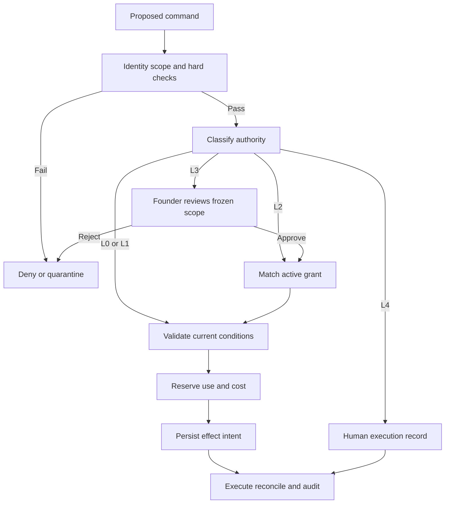

# Part 13 — Policy and Approval Engine

**SEC-004 Command v1**:

```text
command_id UUID; actor_id UUID; workspace_id UUID; action_type ActionEnum;
target_id UUID; payload CommandPayload; policy_version_id UUID;
expected_record_version bigint; approval_id UUID?;
idempotency_key string; budget_request {usd_max, units, category}?;
requested_at timestamp; correlation_id UUID; authentication_context_ref string.
```

Actor and auth context are server-derived. The client cannot choose an approving identity, policy version that is no longer active, or another workspace by altering payload. Every command returns `allow`, `deny`, `require_approval` or `quarantine` with machine-readable reason codes and evidence references. A decision object is not executable authority by itself.

Evaluation order: authenticate → workspace/role → object versions and resource types → active policy/data rights → hard exclusions/suppression → freshness/provider health → approval manifest → cost/volume reservation → transition validity → atomic intent and audit. Hard denies cannot be overridden by model confidence or a general founder approval. Privileged denied attempts are audited without exposing target existence to an unauthorised user.

| Level | Runtime meaning | Examples and required controls |
|---|---|---|
| L0 | Scoped read or deterministic computation | Read evidence, calculate score. Computed persistence uses an L1 command; paid data retrieval still needs prior source/budget authority |
| L1 | Reversible internal write or protective reduction of activity | Save draft, open task, stop campaign, create suppression. No external promise or permissions increase |
| L2 | External effect within exact previously granted scope | Enrol frozen approved cohort; upload internal draft to approved restricted folder; routine paid verification within source policy |
| L3 | New/material external action or authority grant | New campaign, substantive reply, client report, new source, export, resume. Founder reviews exact scope; client authority evidence where required |
| L4 | Human-only binding decision/execution | Price/terms decision, contract signature, payment, final commercial acceptance. AI prepares; no execution route for signatures or funds |

**SEC-005 Outbound guard.** Deny unless all are true: active workspace; correct provider binding; approved and unexpired source rights; allowed email region/purpose policy; known matching identity; current employer relationship where claimed; valid verification ≤7 days old; no active workspace/sender/controller/global suppression; no active competing enrolment; approved sender with checked authentication; fresh stop/reply sync; exact campaign/content/cohort version; current claim evidence; unused approval capacity; remaining sending and cost caps; approved schedule and recipient time zone; client has capacity; provider EXC-001 gate passed. Unknown is a blocker, not a default true.

Initial policy values inherited from the source: 10 new recipients/mailbox/business day, 25 total messages/mailbox/day including follow-ups, maximum three touches over approximately fifteen business days, 25–50-recipient initial cohort, verification seven days, no open tracking. V1 requires recipient time zone from approved evidence or conservative human-reviewed country/region policy; a headquarters location is not automatically the person's location. Configure schedule and caps at provider as well as locally. If native caps cannot bound all touches, block release or reduce the approved design after explicit review.

**SEC-006 Approval snapshot.** Canonicalize the closed ApprovalScope schema and compute SHA-256 over: action type; workspace; target IDs and object versions; frozen recipient/contact hashes; sender; rendered message hashes and claim evidence versions; offer/ICP; exclusions; schedule/timezone; max touches/recipients/spend; source/region policy versions; client authority evidence; allowed connection/resource IDs; expiry; usage limit. Do not include mutable UI labels or generated timestamps in the canonical hash. Freeze exact bytes for dispatch or re-render deterministically and compare hash. Version/hash mismatch invalidates authority.

Default expiry proposal: campaign grant permits its declared schedule up to 21 calendar days, while every touch remains subject to live controls; individual reply/client report dispatch 24 h; provider connection/data-source approval 30-day initial policy review; bulk export one use and 1 h. The founder sees and may shorten these. A campaign needing a longer window needs explicit review. Material changes invalidate; removing suppressed recipients is a safety contraction and does not authorise replacement recipients. No newly generated personalisation after approval.

Batch approval shows one frozen manifest with recipient count, exceptions and sampled content, plus access to every recipient's actual message. One grant may authorise bounded multiple enrolments only for that manifest. Lock approval and quota counters together. Uncertain effects consume a reserved use until proven resolved. Approver identity and MFA are recorded; a user may request and approve in the one-founder stage, but service identities can never approve. Later two-person review can be configured for specified high-risk actions.

**SEC-007 V1 approval types:** campaign release; campaign resume/material revision; substantive reply; proposal dispatch; client report dispatch; source/provider use; source-rights exception resolution; policy activation/budget increase; identity merge; bulk export/document share; engagement scope change; workspace close/erasure plan; model-route promotion; production release. L4 price, signature/payment execution and acceptance are human decision records, not AI-executable approval types. Protective stops, ordinary reviewed-source enrichment and internal drafts do not create routine approval requests.



