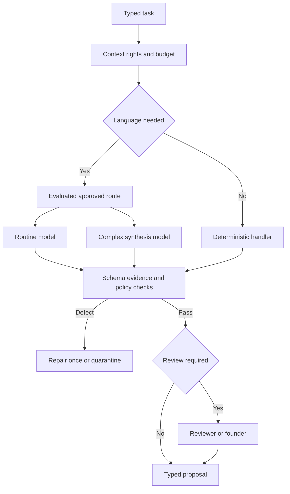

# Part 14 — AI Gateway

**AI-001 AITask v1:** `id UUID`, `task_type TaskEnum`, `task_version int`, `workspace_id UUID`, `subject_refs ResourceRef[]`, `allowed_providers ProviderEnum[]`, `context_pack_id UUID`, `evidence_refs EvidenceRef[]`, `policy_version_id UUID`, `allowed_tools ToolCapability[]`, `output_schema_id string`, `max_cost_usd decimal`, `max_input_tokens int`, `max_output_tokens int`, `max_model_calls int`, `timeout_seconds int`, `sensitivity Classification`, `evaluation_policy_id UUID`, `deadline_at timestamp`. Required fields cannot be supplied by retrieved website text. Default max_model_calls=2 for one generator and one repair; a separately budgeted QA task is separate. No recursive delegation.

**AI-002 AIContextPack:** `id`, `workspace_id`, `task_type`, `created_at`, `expires_at`, `authz_epoch`, `document_permission_epochs`, `company_brief_version`, `icp_version?`, `offer_version?`, `policy_version`, `selected_records[]`, `evidence[]`, `document_excerpts[]`, `thread_excerpt?`, `crm_snapshot?`, `sop_version?`, `tool_descriptors[]`, `output_schema`, `redactions[]`, `omissions[]`, `token_estimate`, `content_hash`. References include type, ID, version, observed_at and validity. Knowledge selection is deterministic before any synthesis.

**AI-003 AIRoute:** immutable `route_id/version`, `task_type/version`, `primary_provider`, `primary_model_id`, `model_snapshot?`, `fallback_provider/model?`, `capabilities_required`, `price_config_version`, `quality_eval_id`, `allowed_sensitivity`, `region_policy`, `temperature_or_provider_options`, `token_caps`, `cost_cap`, `timeout`, `review_policy`, `approved_by`, `activated_at`. Provider-specific options remain inside adapters. A display name is not a callable API model ID.

**AI-004 AIResult:** `task_id`, `status enum(proposed,refused,incomplete,invalid,quarantined)`, `result typed-by-task`, `claim_evidence_map[]`, `unknowns[]`, `uncertainties[]`, `proposed_actions[]`, `provider`, `model_id`, `reported_model_version?`, `route_version`, `prompt_version`, `schema_version`, `usage {input_tokens,output_tokens,cached_tokens,billable_units}`, `cost {estimated_usd,confirmed_usd?,price_version,reservation_id}`, `latency_ms`, `validation {schema,evidence,policy,semantic,defects[]}`, `provider_request_id?`. No hidden chain-of-thought. A concise explanation of evidence and uncertainty is permitted.

**AI-005 AIEvaluation:** `dataset_id/version`, `split`, `task_type/version`, `route_candidate`, `sample_count`, `class_counts`, `metrics`, `confidence_intervals?`, `hard_failure_examples[]`, `cost_per_useful_output`, `latency_percentiles`, `founder_edit_rate`, `reviewer`, `decision`, `run_at`. Promotion is a recorded human decision; adding a new model alias is a release, not a config shortcut.

Routing order: code when sufficient → sensitivity/rights filter → evaluated routine route → complex route only for task need → optional approved fallback → selective independent QA → proposed output. If neither approved provider is available, persist waiting work. Do not send client data to a second provider merely to maintain speed.

OpenAI structured outputs and Anthropic JSON-schema outputs support typed result contracts, but factual validation is still ours. Handle refusal, incomplete output and unsupported schema separately. Anthropic's documented API uses `output_config.format`; maintain provider translation inside its adapter. [OpenAI structured outputs](https://developers.openai.com/api/docs/guides/structured-outputs), [Anthropic structured outputs](https://platform.claude.com/docs/en/build-with-claude/structured-outputs).

Use official SDKs with automatic retries disabled or explicitly reconciled with the job runtime; otherwise SDK retries can multiply cost and obscure uncertain calls. Set OpenAI `store:false` where supported and required by policy; this controls response application storage, not every provider retention mechanism. [OpenAI Responses migration guidance](https://developers.openai.com/api/docs/guides/migrate-to-responses). Exact model IDs, account support, pricing and retention configuration require preflight. Consumer ChatGPT/Claude access does not establish production API entitlement; provision service projects, keys and API billing independently and verify current billing terms before purchase.

A model can request only enumerated read tools against its context workspace. The worker resolves opaque IDs; the model cannot supply a new workspace or destination URL. Paid tool calls require reservation. Maximum four retrieval calls per routine task, three allowed public pages/account by default, and no arbitrary shell/browser/email tool. Public retrieval blocks loopback, private/link-local IPs, metadata endpoints, redirects into disallowed ranges, DNS rebinding and oversized downloads. Raw untrusted text is labelled data, never injected into a privileged instruction slot.

