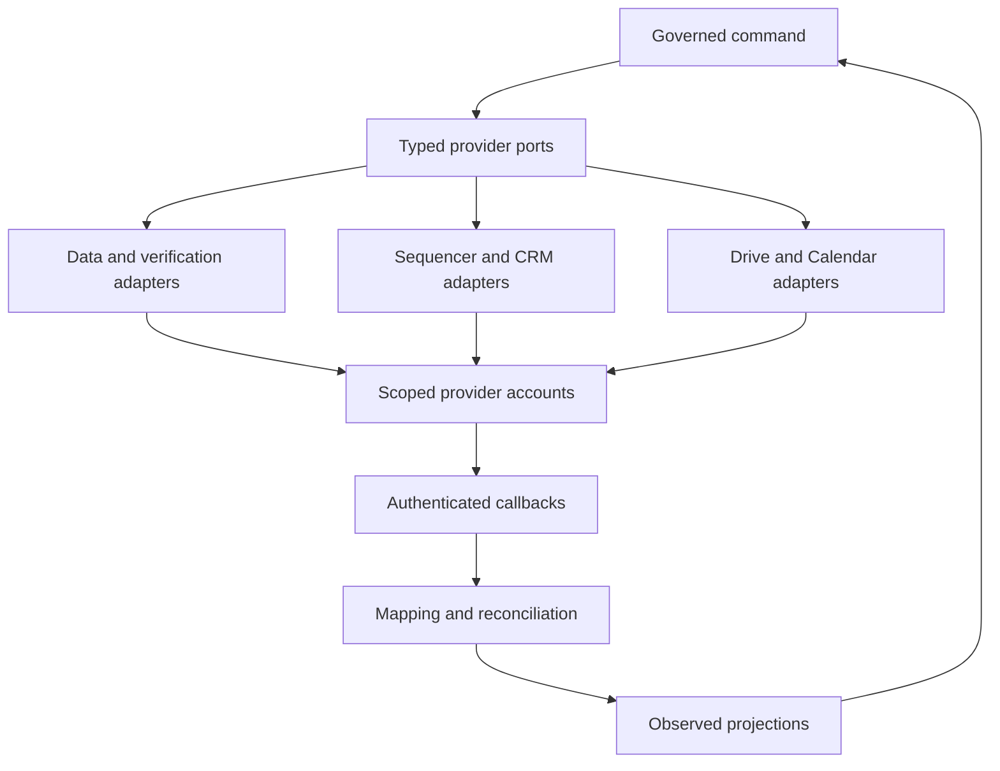

# Part 16 — Knowledge and Context Architecture

Approved company memory comprises structured facts and decisions, CRM commercial context and versioned documents. Chat histories are neither imported wholesale nor treated as instructions. A decision captured in chat becomes authoritative only when saved as a reviewed Decision/Policy record.

**AI-025 Context selection algorithm.** Resolve authenticated workspace/task → select approved company brief share → exact active ICP/offer/policy versions → subject facts and relevant unexpired signals → explicitly selected thread/CRM fields → task SOP and proof references → enforce document ACL and source purpose → redact → budget tokens → persist immutable manifest. Default routine context cap 8,000 input tokens and 1,500 output; complex tasks 24,000 input and 4,000 output, lowered if the cost ceiling requires. These are internal caps, not model limits. Sort mandatory policy/schema/identity first, then recent relevant evidence; omit older low-priority data with a recorded omission reason. Never truncate permission instructions to fit more prospect text.

Full-text search is workspace-filtered SQL over approved chunks. Search results join current document and membership access before returning text. No global unscoped search followed by client-side filtering. Cache key includes workspace, principal role/capability, permission epoch, policy version, source version and query; TTL five minutes for discovery and no cache for final authority checks. Context packs expire within 24 hours and earlier when any required source expires. Immediately before promotion/dispatch, recheck every material reference; an already running model result is discarded if permissions were revoked mid-call. Prior disclosure cannot be undone, but further use is blocked and investigated.

Human-editable Google documents require a stable exported snapshot for approval: obtain revision metadata, export, recheck metadata; retry if changed during export. Store exported bytes under restricted Drive storage and hash them. Do not assume an editable Google Doc revision remains indefinitely retrievable. Final contracts and approved campaign manifests refer to immutable snapshots. Original editable files remain authoritative for future edits, not for already approved bytes.

Freshness defaults: policy/offer/rate card/proof must be approved and before review_due; email verification ≤7 days; employment evidence review ≤30 days before a personalised claim; general account facts ≤90 days; signal expiry depends on type, default 30 days. Explicitly dated historical facts may remain usable with accurate wording. More restrictive rights/contract limits win.

Deletion or revocation invalidates catalogue, chunks, context cache, generated drafts relying on revoked rights, pending approvals and exports where required. Record propagation receipts and failures. Do not store identity documents, passwords, private tax files or complete inbox history in the general index. Add pgvector only after ≥50 representative retrieval queries show material recall improvement over full-text search while preserving precision, cost and ACL tests; use PostgreSQL first and require an ADR.

# Part 17 — Integration Architecture

All provider adapters implement typed ports, not vendor-shaped domain objects. Common context is `{workspace_id,connection_id,operation_id,correlation_id,deadline,budget_reservation_id?,effect_key?}`. Outputs are `{data,provider_refs,observed_at,next_cursor?,usage,request_id?,raw_payload_ref?}`. Errors are `auth_failed`, `forbidden`, `rate_limited(retry_after?)`, `validation_failed`, `not_found`, `capability_unavailable`, `transient`, `ambiguous_effect`, `schema_changed`. Provider-specific codes remain attached for diagnosis. Raw HTTP clients have query-string/header redaction, bounded timeouts, allowed hosts and no automatic unsafe POST retries.

## Provider contracts and current evidence

**INT-001 Apollo — LeadDataProvider.** Functions: `search_accounts(filters,cursor)`, `search_people(account_ref,role_filters,cursor)`, `enrich_account(provider_ref)`, `enrich_person(provider_ref,allowed_fields)`, `get_usage()`. API-key authentication uses `x-api-key`; partner OAuth is separately documented. People search returns candidate identities, not email/phone contact data; enrichment is a separate authorised operation. Search pagination has a documented 100-record page/500-page display boundary; narrow queries rather than treating a truncated result as complete. [Apollo authentication](https://docs.apollo.io/reference/authentication), [People API Search](https://docs.apollo.io/reference/people-api-search).

Rate limits vary by endpoint/plan; capture actual limits and credit cost into the connection report. [Apollo rate limits](https://docs.apollo.io/reference/rate-limits). **IMPLEMENTATION PREFLIGHT REQUIRED:** selected plan endpoints, client-service data rights, exact paid enrichment cost, export/retention/deletion rights, async enrichment callbacks and usable testing mode. V1 can use synchronous reads and fixtures; no webhook dependency and no write-back to Apollo lists. Treat an enrichment timeout as possibly billed. No guessed contact data. A client workspace requires its own authorised connection or explicit provider permission; one founder subscription is not assumed to cover all clients.

**INT-002 ZeroBounce — EmailVerifier.** Functions: `verify_email(address,request_ref)`, `get_balance()`, optional `get_usage()`. Map provider status/substatus into DATA-021; store timestamp and raw category, not just boolean valid. API requires a key and SSL; documentation supplies special sandbox addresses. [ZeroBounce validation](https://www.zerobounce.net/docs/email-validation-api-quickstart/v2-validate-emails), [ZeroBounce sandbox](https://www.zerobounce.net/docs/email-validation-api-quickstart/v2-sandbox-mode). Single-address V1 needs no pagination or webhook. Avoid bulk file uploads initially. **IMPLEMENTATION PREFLIGHT REQUIRED:** effective rate/concurrency limits, credits, retention, acceptable account use and error behavior. The single-validation page says no rate limit, while broader quickstart guidance can differ by endpoint; choose conservative concurrency and handle 429 rather than assuming unlimited capacity.

**INT-003 Smartlead — Sequencer.** Functions: `create_draft_campaign(config,effect_ref)`, `set_sequence(versioned_steps)`, `set_schedule(schedule)`, `set_sender(binding)`, `read_campaign()`, `list_campaign_leads(cursor)`, `enroll(approved_target,effect_ref)`, `pause_campaign()`, `stop_enrollment()`, `unsubscribe_contact(scope)`, `list_message_history(cursor)`, `get_lead_status()`, `list_or_configure_webhooks()`, `remove_test_data()`. Each maps only after endpoint preflight. API documentation includes campaign/lead management, stop operations and plan-dependent limits. Settings examples use API key in URL parameters, so URL logging must redact keys. [Smartlead API overview](https://helpcenter.smartlead.ai/en/articles/125-full-api-documentation), [campaign settings](https://api.smartlead.ai/api-reference/campaigns/update-settings).

Webhook documentation describes events, origin checking and retries; these are not proof that every account supplies a usable signature header or identical delivery policy. [Smartlead webhooks](https://api.smartlead.ai/core/webhooks). **IMPLEMENTATION PREFLIGHT REQUIRED:** actual signature secret/header/canonicalization and rotation; provider event IDs; pagination; export/delete; sandbox or test-account mode; lead-versus-global unsubscribe; native reply stop before classification; one-second race behavior; scheduled campaign expiry; copy/schedule drift visibility; idempotency or reliable effect lookup; account/mailbox caps including follow-ups; client isolation; suppression stop during application outage. Default capability flags are false. No live sending until all required flags are demonstrated and EXC-001 is resolved.

If history lookup cannot distinguish “request never executed” from “response lost,” the adapter returns ambiguous_effect and human reconciliation. It must not return safe_to_retry based solely on an empty page. Smartlead's availability as a paid product does not establish suitability for this exact safety contract.

**INT-004 Pipedrive — CRM.** Functions: `upsert_identity_projection(internal_uuid,approved_fields)`, `create_lead()`, `create_deal()`, `propose_or_apply_commercial_change(command)`, `create_activity()`, `add_note()`, `get_deal()`, `list_changed_objects(cursor)`, `list_stages()`, `register_webhook()`, `delete_test_object()`. Prefer v2 where provided; preserve endpoint-specific pagination instead of assuming all endpoints use one scheme. Organisation documentation includes cursor pagination and older v1 offset endpoints. Webhooks are available through the developer API. [Pipedrive organisations](https://developers.pipedrive.com/docs/api/v1/Organizations), [webhooks](https://developers.pipedrive.com/docs/api/v1/Webhooks).

API usage is constrained by token budgets and burst limits; read actual response headers/account allocation. [Pipedrive rate limiting](https://pipedrive.readme.io/docs/core-api-concepts-rate-limiting). **IMPLEMENTATION PREFLIGHT REQUIRED:** authorised OAuth application or permitted token route, scopes, renewal/revocation, webhook authentication and v2 payload details, required custom-field entitlements, test/sandbox account, deletion/export, client-native visibility and conflict preconditions. Do not assume ETag/If-Match or POST idempotency. If no conditional write is supported, fetch-before-write detects many conflicts but cannot eliminate the race; material commercial edits remain human-reviewed with a reconciliation conflict task. Never overwrite external stage changes just because local expected_version passed.

**INT-005 Google Drive — DocumentStore.** Functions: `create_restricted_folder()`, `upload_document()`, `read_metadata()`, `export_document()`, `read_or_download_version()`, `list_changes(page_token)`, `read_permissions()`, `grant_access(approved_share)`, `revoke_access()`, `trash_or_delete(approved_plan)`. Choose OAuth with minimum workable scopes and explicitly selected folders/shared drives. User-owned files and shared-drive ownership must be distinguished in the connection record. Do not request domain-wide delegation for convenience. Notifications trigger retrieval of actual changes; persist page tokens and renew expiring watches. [Drive notifications](https://developers.google.com/workspace/drive/api/guides/push), [changes list](https://developers.google.com/workspace/drive/api/reference/rest/v3/changes/list).

**IMPLEMENTATION PREFLIGHT REQUIRED:** OAuth scope sufficiency for existing versus app-created files; Workspace plan/shared-drive support; upload/export quotas and file limits; exact export/delete/permission endpoint behavior; ACL inheritance and test folders; revisions suitable for immutable snapshots. No public link sharing by default. If permissions cannot be proven, no model retrieval or external sharing. A generated draft uploaded to an approved private workspace folder is L2 under policy; new external sharing is L3.

**INT-006 Google Calendar — CalendarProvider.** Functions: `list_events(window,sync_token?)`, `get_event(calendar_id,event_id)`, `watch_events()`, `renew_watch()`, `stop_watch()`. V1 calendar writes stay in the native UI; local attendance/consent are separate records. Push notifications are hints, not complete meeting payloads. Incremental sync and full resync on an invalid token are required. [Calendar push notifications](https://developers.google.com/workspace/calendar/api/guides/push), [Calendar synchronization](https://developers.google.com/workspace/calendar/api/guides/sync). **IMPLEMENTATION PREFLIGHT REQUIRED:** OAuth read scope, authorised calendars, quotas, channel auth/expiry, recurrence/cancellation behavior and test calendar. Test sync-token 410 recovery without duplicating recurring instances. Meeting status cannot establish attendance.

**INT-007 OpenAI and Anthropic — AIProvider.** Functions: `generate_typed(task,context,schema,limits)`, `normalize_usage(response)`, `normalize_error(response)`, `capabilities(model_id)`. Synchronous bounded calls initially; no provider-hosted autonomous agent state required. API keys are service-only; separate environment projects/keys. Both typed-output capabilities are documented; exact model compatibility and entitlement remain preflight. [OpenAI structured outputs](https://developers.openai.com/api/docs/guides/structured-outputs), [Anthropic structured outputs](https://platform.claude.com/docs/en/build-with-claude/structured-outputs), [Anthropic limits](https://platform.claude.com/docs/en/api/rate-limits). API billing is provisioned independently; Anthropic explicitly separates paid chat subscriptions from API/Console access. [Anthropic billing distinction](https://support.claude.com/en/articles/9876003-i-have-a-paid-claude-subscription-pro-max-team-or-enterprise-plans-why-do-i-have-to-pay-separately-to-use-the-claude-api-and-console).

No paging or webhook is required for synchronous V1 inference. Provider request IDs are for audit; they do not establish cost-free retries. **IMPLEMENTATION PREFLIGHT REQUIRED:** callable model IDs, current rates, data-processing policy, retention settings, region, request/token limits, max output and structured/tool combinations, deletion/export options if storing provider-side artifacts. Disable such storage features unless needed and approved. There is no assumption of a free sandbox.

**INT-008 n8n Cloud.** Functions from Company OS's perspective: `invoke_approved_workflow(job_ref,typed_input)`, `receive_completion(job_ref,result)`; all business mutation returns through command API. n8n webhook credentials support authenticated endpoints; select the documented supported method and rotate separately from provider keys. [n8n webhook credentials](https://docs.n8n.io/integrations/builtin/credentials/webhook). **IMPLEMENTATION PREFLIGHT REQUIRED:** plan execution/concurrency caps, retention, workflow export and environment features, actual callback authentication. No direct DB writes, no master credentials and no sending step in n8n. V1 correctness does not depend on n8n running.

**INT-009 Supabase and Render.** PostgreSQL is the portable database interface; managed Auth is wrapped by our principal mapping. Supabase RLS needs explicit grants/roles, not merely a checkbox. Render background workers are persistent processes without inbound network endpoints; provider webhooks therefore terminate at the API web service. [Supabase RLS](https://supabase.com/docs/guides/database/postgres/row-level-security), [Render workers](https://render.com/docs/background-workers). **IMPLEMENTATION PREFLIGHT REQUIRED:** paid always-on service selection, database connection limits/region, Auth MFA configuration, backup/PITR entitlement, secret permissions, pricing and operational access. See Part 24.

## Preflight evidence record

Every connection report includes owner, workspace, provider account ID, plan, documentation URLs and checked date, exact auth/scopes, operation allowlist, rate/credit limits, pagination samples, webhook auth/retry/order examples, export/delete receipts, idempotency result, timeout reconciliation result, sandbox strategy, data rights and retention, failure/cancellation test results and a signed technical decision. Each capability is `verified`, `unsupported` or `unverified`. Production feature flags consume this report and expire after material provider/account change. Documentation-only evidence cannot pass an account-specific test.

