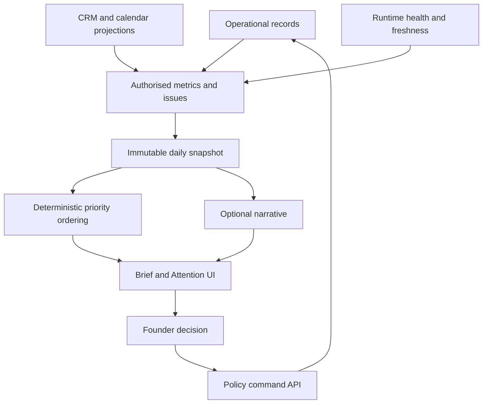

# Part 19 — Founder Console Product Specification

**UI-001 Layout.** Desktop-first private console with persistent workspace switcher, clear workspace purpose/client label, freshness indicator, notification count and signed-in role. `/` redirects to `/attention`. A global incident banner remains visible across routes. Tables support keyboard navigation, accessible labels, readable timestamps in selected timezone and authoritative source links. Actions display the affected workspace, version and consequence before execution. Browser buttons never imply a command completed merely because it was queued.

| Route / ID | Purpose, sources and displayed fields | Actions, writes and approvals | Filters and drilldown | Empty and failure state |
|---|---|---|---|---|
| `/attention` UI-002 | Up to five primary decisions from attention items, incidents, tasks, approvals, metrics | Open, decide through approval command, request revision, permitted snooze | Workspace, priority, due time, owner; source records and exact command | “No decisions require action” only with healthy sources; otherwise stale/unknown banner |
| `/approvals` UI-003 | Scope/hash/version, audience, content, limits, QA and expiry | Approve/reject/revise/revoke; fresh MFA for grant | Type, expiry, requester, workspace; full manifest diff | None pending versus failed load distinctly; stale action disables grant |
| `/pipeline` UI-004 | CRM-owned deals by stage, amount basis, next action, source freshness | Open Pipedrive; request explicit commercial change | Engine A/B, owner, stage, next-action age, currency | No connected CRM shown explicitly; never zero pipeline on API failure |
| `/accounts` UI-005 | Identity, domains, evidence, signals, score components and missingness | Add sourced account, request research, propose correction/merge | Fit, industry, geography, data freshness; account timeline | No accounts→authorised import/research task; conflict badge blocks use |
| `/leads` UI-006 | Operational stage, eligibility, verification, suppression and current enrolment | Assess eligibility, qualify/disqualify, archive, protective suppress | ICP/offer, reasons, source, owner; evidence and permission chain | Missing contact distinct from ineligible; provider failure preserves last known data |
| `/campaigns` UI-007 | Definition version, observed execution, frozen cohort, outcomes, spend, stop health | Draft/revise, run QA, request approval, release, pause, request resume | State, source, sender, date; message samples/full manifest/effects | No campaign→draft; uncertain execution prominent, “paused” only for local intent until confirmed |
| `/opportunities/{id}` UI-008 | CRM projection, interactions, meeting packs, proposal/worksheet references | Prepare brief/proposal, request CRM change, open source systems | Timeline/type; source fields and submitted changes | Missing CRM permission shows restricted/stale state; no local edit fallback |
| `/clients` UI-009 | Engagement scope, due deliverables, accepted items and risks | Start onboarding, request report, record authorised acceptance, request closure | Active/at-risk/due/owner; linked contract and acceptance | No clients; missing payment/scope gate explained |
| `/agents` UI-010 | Agent tasks, routes, validations, costs, unknowns and failures | Inspect source/summary, request reviewed rerun, propose route promotion | Role/task/provider/version/cost/outcome | No runs yet; failed runs not erased by rerun |
| `/system` UI-011 | Health registry, jobs, sync cursors, DLQ, budgets, backup/restore evidence | Pause affected work, retry eligible job, open incident/preflight | Provider, severity, oldest job; trace to receipt | Unknown monitoring state is amber/red for affected execution, never green |
| `/knowledge` UI-012 | Approved document catalogue, purpose, version, permissions and review due | Register, open Drive, propose update/review, revoke usage | Type/workspace/classification/review date | No approved source→cannot draft factual claim; ACL failure removes preview |
| `/settings` UI-013 | Roles, provider capability reports, policies, budgets, timezone and sender status | Request scoped changes; founder approvals; credentials configured through secret flow | Workspace/category; before/after diff | Unconfigured provider cannot be enabled; never display actual secrets |

Finance appears only as a small source-labelled summary in Attention/client context until an approved ledger integration exists. No separate finance editor is built. Replies link to the native provider inbox and show the necessary excerpt; a custom inbox is excluded.

## Attention behavior

**UI-014 AttentionItem contract:** `id`, `workspace_id`, `issue_type`, `priority_class`, `title`, `impact_summary`, `why_now`, `deadline_at?`, `source_refs[]`, `recommendation`, `alternatives[]`, `requested_decision:{command_type,target_id,payload_hash,approval_id?}`, `confidence:{basis,calibration_status}`, `freshness:{as_of,oldest_required_source_at,status}`, `state`, `owner_role`, `snoozed_until?`, `issue_fingerprint`, `created_at`, `last_changed_at`. Confidence is based on evidence/validation status, not a decorative model percentage.

Deterministic priorities: **P0** security incident, opt-out violation, duplicate send, imminent client harm; **P1** campaign safety failure, critical delivery/cash anomaly, approval with a real deadline; **P2** time-sensitive sales/meeting preparation; **P3** optimisation/data cleanup. Sort class first, overdue/deadline next, then configured impact and age; UUID tie-breaker. AI may recommend within-class order only. If >5 critical items exist, show first five plus a conspicuous “N further critical incidents” section; no critical issue disappears behind an ordinary dashboard card. Snoozing changes the review reminder, not safety holds. P0 banners cannot be hidden; P1 snooze requires reason and cannot pass deadline.

## Approval UX

Campaign review displays approved ICP/offer, account and recipient counts, exclusion reasons, source/rights summary, sender identity, all message versions, factual claim examples and access to every rendered message, cadence/timezones, daily and total caps, expiry, spend ceiling, evidence freshness, client authority and QA results. The approve button states “Approve this version for this frozen cohort.” A change since opening the page forces refresh and diff review; no silent resubmission.

Substantive reply: exact thread excerpt, target address, proposed response, claims, commercial promises, stop status and one-use expiry. Proposal: exact final document hash, code worksheet, approved price/terms decision, scope exclusions and intended recipient. Client report: accepted versus merely submitted work, metric source refs, unresolved risks and exact recipient. New source/provider: purpose, data types, account/plan, rights, retention, allowed operations, cap and preflight results. Export/share: precise fields/count/destination/expiry and rights constraints. Policy/budget/model changes: current versus proposed rules, affected workflows, evaluation evidence and rollback. Merge: both identities, evidence, affected history and reversal plan. Closure: obligations, export permissions, deletion/retention plan and unresolved receipts. Batch decisions operate only on individually frozen cases; one invalid case does not silently approve the rest without explicit per-case results.

## Health rules

**UI-015 HealthComponent** contains name, status green/amber/red/unknown, reason_codes, measured_at, last_success_at, current_value, threshold_version, impacted_workspaces, affected_actions, incident_id?, next_check_at. Global status is the worst required component; unused/unconfigured optional integrations are “not configured,” not green.

| Component | GREEN | AMBER | RED and automatic action |
|---|---|---|---|
| Database/API | Current probe and successful scoped transaction | One failed probe or rising latency | Three failed probes/≥60 s failure: no new commands/effects; external uptime alert |
| Worker/queues | Heartbeat <30 s, safety oldest≤5 s, normal≤60 s | Heartbeat 30–60 s or normal >5 min | Heartbeat >60 s or safety oldest>10 s: stop discretionary scheduling, incident |
| Sequencer/reply safety | Reconciliation checkpoint ≤2 min, no divergence | >2 min≤5 min or uncertain provider status | >5 min, stop failure or any known violation: pause affected campaign and block release |
| CRM/Calendar | Successful sync ≤10 min | >10 min≤30 min | >30 min or auth revoked: block dependent commercial automation; show stale projection |
| Suppression propagation | Confirmed or pending <60 s | Pending 60 s–5 min | >5 min or confirmed send after known suppression: P0, attempt provider pause |
| Verifier/Apollo | Calls healthy, known entitlement and sufficient quota | Transient failure/quota >80% | Auth/rights failure or depleted credits: block dependent research/eligibility |
| AI | Approved route healthy, validators passing | 3 consecutive provider errors or elevated defect rate | Rights/secret incident or critical regression: disable affected route; deterministic fallback |
| Dead letters | None unowned | Owned noncritical DLQ | Unowned safety DLQ or repeated three same-type terminal failures: incident |
| Spend | Used+reserved <80% cap | ≥80%<100% | ≥100%: no discretionary paid dispatch; protective work continues |
| Knowledge | Required version current | Noncritical review overdue | Outward claim/price/policy stale: block affected effect |
| Backup/restore | Backup age meets current RPO and restore drill current | Backup approaching RPO; drill due within 14 days | RPO exceeded or restore fails: freeze release expansion; investigate before continued live operation |

Quiet webhook traffic is not a red condition by itself. Display last event age alongside last successful reconciliation and expected activity. A worker cannot detect its own complete outage; use an independent HTTPS uptime monitor and heartbeat-age check outside that worker.

## Daily company brief contract

**UI-016 DailyBrief v1** is a deterministic snapshot plus optional narrative. All top-level keys below are required; metric values may be null with explicit missingness. Schemas use closed objects:

```text
RecordRef = {workspace_id:UUID, resource_type:string, id:UUID,
             version:string, source_system:string, source_id:string?, as_of:timestamp}
Freshness = {status:current|stale|missing|partial, as_of:timestamp?,
             checked_at:timestamp, maximum_age_seconds:int, reason:string?}
Metric = {definition_id:UUID, definition_version:int, value:decimal-string|null,
          unit:string, currency:string|null, period_start:timestamp,
          period_end:timestamp, numerator:decimal-string|null,
          denominator:decimal-string|null, sample_size:int|null,
          cohort_id:UUID|null, source_refs:RecordRef[],
          query_snapshot_ref:RecordRef|null, freshness:Freshness,
          assumptions:string[], uncertainty_note:string|null}
DailyBrief = {
  schema_version:1, snapshot_id:UUID, snapshot_version:int,
  generated_at:timestamp, reporting_date:date, timezone:IANA,
  authorised_workspace_ids:UUID[], is_late:boolean,
  data_freshness:[{source:string, workspace_id:UUID, state:Freshness}],
  attention_items:AttentionItem[], additional_attention_count:int,
  critical_incident_refs:RecordRef[],
  sales:{open_pipeline:Metric[], weighted_pipeline:Metric[],
         accepted_opportunities:Metric, next_actions_overdue:Metric,
         meetings_today:RecordRef[], packs_missing:RecordRef[]},
  outbound:{researched_accounts:Metric, contacted_people:Metric,
            attempted_sends:Metric, hard_bounces:Metric, human_replies:Metric,
            positive_replies:Metric, opt_outs:Metric,
            paused_campaigns:RecordRef[], uncertain_effects:RecordRef[]},
  clients:{active_engagements:Metric, deliverables_due:RecordRef[],
           accepted_on_time:Metric, unresolved_risks:RecordRef[]},
  finance:{availability:available|partial|unavailable,
           cash:Metric[], receivables:Metric[], recurring_revenue:Metric[],
           source_note:string},
  system_health:{overall:green|amber|red|unknown,
                 components:HealthComponent[], last_restore_ref:RecordRef|null},
  ai_operations:{tasks_completed:Metric, useful_output_rate:Metric,
                 spend_usd:Metric, reserved_usd:Metric,
                 failures:RecordRef[], route_versions:string[]},
  recommendations:[{id:UUID, text:string, evidence_refs:RecordRef[],
                    proposed_command_type:string|null, authority_level:L0|L1|L2|L3|L4,
                    requires_approval:boolean}],
  narrative:{mode:model|deterministic, text:string, agent_run_id:UUID|null},
  content_hash:sha256
}
```

Each scalar count, rate and monetary value uses Metric. IDs in lists are the authoritative records; derived numbers have either complete source_refs or a reproducible query snapshot referencing the immutable contributing record set and formula version. Do not list a dashboard URL as evidence for a number. Null denominator produces null rate and `insufficient_data`; zero replies may be 0 only when sync is complete. Do not combine currencies without an approved exchange-rate source/time; default show separate currency totals. Weighted pipeline labels assumed probabilities. Finance remains unavailable without a source; no model estimate of bank balance.

For reference, use source definitions: human reply rate = unique human responders / unique contacted people in a mature cohort; positive reply rate uses confirmed relevant positive responses; bounce rate uses hard bounces / attempted sends for the same window; win rate = won / (won+lost) qualified opportunities; on-time delivery = accepted on/before due date / due deliverables. Store event-time window, extraction cutoff and late-event corrections. A corrected daily snapshot creates snapshot_version+1 and links the replaced version; no silent history rewrite.



