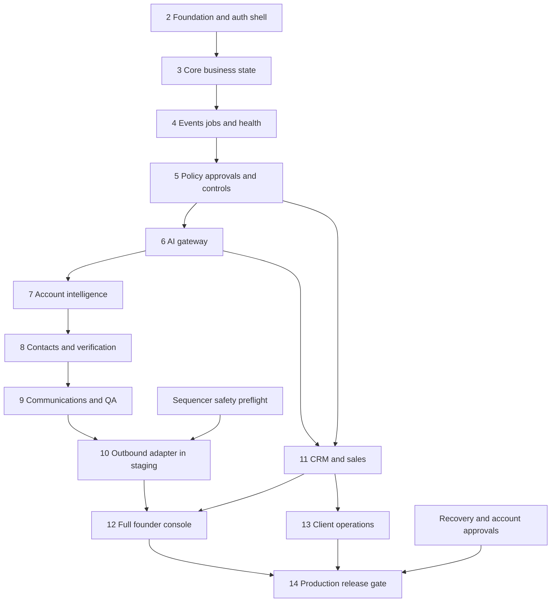

# Part 28 — Implementation Dependency Graph

Phase numbers identify reviewable engineering releases, not a promise to run all work concurrently. Every phase waits for explicit founder gate approval. A dependency edge means technical prerequisite; it does not authorise the next phase.

Phases 11 and 13 can be prepared without live outbound; this prevents a sequencer limitation from blocking meeting preparation or client records. Phase 10 never independently grants production sending. UI shell/control routes begin in Phases 2/4/5; full console integration is Phase 12. Security, audit and cost controls start in the foundation, not in a late hardening cleanup.

# Part 29 — Phase 2 Onward Build Plan

Complexity scale: **S** narrowly bounded module; **M** several contracts; **L** substantial integration/failure behavior; **XL** multiple external safety dependencies. These are relative estimates, not hours, dates or procurement quotes. Split a large phase into the named increments if necessary, but do not roll their gates into one unreviewable build.

## Phase 2 — Repository and platform foundation

**Objective:** create a locally runnable, tested skeleton with real tenant-aware authentication boundaries and no business integrations. **Modules:** apps/api, apps/worker bootstrap only, apps/console auth shell; domain value types; persistence session; contracts; engineering docs. **Dependencies:** approved Phase 1 specification and assigned technical reviewer; no paid vendor required for fake local run. **Database:** first migrations for workspace, principals/users/services, roles/memberships and audit skeleton; synthetic A/B fixtures. No business tables yet. **API:** API-002/003/061, minimal authorised workspace lookup, consistent error/version envelope. **UI:** sign-in, workspace selector, empty Attention/Approvals/Health routes. **Integrations:** managed Auth development setup or documented fake auth for CI; DB only. **Tests:** TEST-001 on foundation tables, TEST-018,019,031; migration from empty DB and nonowner runtime role.

**Acceptance:** one command starts local services; authenticated user sees only assigned synthetic workspace; missing auth context denies SQL access; secrets excluded; contract generation/locks/CI work; health endpoint leaks no details. **Exclusions:** AI calls, CRM, data imports, jobs runtime, sending, production deployment. **Complexity M. Risks:** auth/connection pool leakage, accidental Data API grants. **STOP GATE P2:** provide changed-path/requirement/test manifest and a reproducible local demo. Founder reviews before Phase 3; do not generate later migrations “for convenience.”

## Phase 3 — Core business state

**Objective:** store sourced identities and versioned operating definitions. **Modules:** domain/identity, intelligence records, prospecting records, knowledge metadata, reporting basics. **Dependencies:** P2 approved. **Database:** DATA-007,009–020,025 identity history, ICP/offer, document catalogue metadata and data-source rights; permission/suppression skeleton to prevent unsafe imports. **API:** API-004–006,009/010,012/013,017–020,054/056; draft-only definition commands documented before implementation. **UI:** account/lead list and evidence detail; no elaborate dashboards. **Integrations:** fake source and document store. **Tests:** TEST-001,008 structural support,016,017 metadata isolation,028.

**Acceptance:** create account/person/employment/lead with same-workspace FKs; reproduce score; preserve unknowns; shared-domain subsidiaries stay distinct; wrong-tenant child insert fails in DB; reviewed merge snapshot can reverse. **Exclusions:** provider discovery, paid verification, campaign execution and AI synthesis. **Complexity L. Risks:** overgeneralized resource references and hidden dual-master identity. **STOP GATE P3:** demonstrate 20 synthetic records with provenance and invalid cross-tenant operations rejected; no runtime work until reviewed.

## Phase 4 — Events, durable jobs and system health

**Objective:** survive restart and event duplication before adding expensive or consequential effects. **Modules:** workflow, inbox/outbox, scheduler, leases/fences, effect-intent skeleton, observability. **Dependencies:** P3. **Database:** DATA-050–053, schedules/dependencies, health incidents and audit completion. **API:** API-051–053/059–063 using fake callbacks; no live sends. **UI:** System Health, job detail, dead-letter list and trace links. **Integrations:** fake provider plus n8n fixture callback; n8n Cloud not required. **Tests:** TEST-004,007,009,012–014,021,027,029.

**Acceptance:** duplicate event/consumer atomically dedupes, schedule emits once, restart recovers work, stale fence fails, unresolved dispatch stays uncertain, cost reservation cannot race past cap, safety lane remains available under load. **Exclusions:** real external effects, AI, campaign approval UI. **Complexity L. Risks:** mistaken exactly-once claims, lease/effect race, retries multiplying. **STOP GATE P4:** crash/restart/DLQ/uncertain-effect demo and passing fault-injection evidence; no policy/AI phase automatically begins.

## Phase 5 — Policy, approvals and minimum founder controls

**Objective:** implement authority before any provider can act. **Modules:** policy, approval manifest/hashing, suppression, usage reservation, RBAC and command layer. **Dependencies:** P4. **Database:** DATA-022–024,045–049, grant scopes and policy versions; frozen campaign manifest structures as required for tests. **API:** API-026,035/036,047–050,064–066 and command validation. **UI:** Approvals and five-item Attention with exact diff/version/expiry, MFA and protective stop; test campaign cases. **Integrations:** fakes only. **Tests:** TEST-001–006,009/010,018,024 fixture,030.

**Acceptance:** material edits invalidate grants; stale/expired/overused grant denied under concurrency; AI cannot approve; suppression dominates; approval screen reflects same hash executed by dispatcher. **Exclusions:** live sequencer, real data purchases, full campaign composer. **Complexity L. Risks:** approval fatigue, broad grants and counter reuse. **STOP GATE P5:** founder can approve/reject/revise a synthetic exact case and see blocked changed-version execution; review before AI integration.

## Phase 6 — AI gateway and evaluation harness

**Objective:** bounded language tasks with transparent cost and no external authority. **Modules:** ai/context/routing/validation/evaluation; OpenAI/Anthropic adapters. **Dependencies:** P5; funded development API access and provider data-policy preflight only if real calls are used. **Database:** DATA-054, context references, route/prompts/eval registries and usage detail. **API:** API-057; route-promotion request contract added under SEC-007. **UI:** AI run inspector with unknowns, evidence, usage and failure; no model-selection burden on founder. **Integrations:** both fake adapters first, then approved real test calls. **Tests:** TEST-008–011,017,022,024 relevant regression.

**Acceptance:** schema/semantic failures quarantine; one repair maximum within cap; allowed fallback only; no secret or cross-tenant context; evaluation report and route promotion/rollback available. **Exclusions:** autonomous agents, recursive delegation, production provider activation. **Complexity L. Risks:** apparent schema correctness hiding unsupported claims, changing prices/model compatibility. **STOP GATE P6:** publish actual eval results and remaining sample gaps; founder approves tested routes before research workflow.

## Phase 7 — Account intelligence vertical slice

**Objective:** useful account intelligence from authorised evidence through a reviewable score. **Modules:** research workflow, evidence extraction, deterministic score and account detail. **Dependencies:** P6; Apollo/source preflight or approved public-source path. **Database:** source connection/mapping, evidence, signals, scores and knowledge version snapshot details. **API:** API-007/017–020/056. **UI:** account pack with facts, sources, missingness and score explanation; source-rights status. **Integrations:** Apollo account search/enrichment and restricted public retrieval; Drive snapshot upload if enabled. **Tests:** TEST-001,008,011,016/017,021/022,028/029.

**Acceptance:** 20 authorised synthetic/test accounts processed, every factual claim has a supporting source, duplicate domain ambiguities hold, score exactly reproducible, cost/account visible and restart safe. **Exclusions:** contact enrichment, sending and claimed buying intent. **Complexity M. Risks:** source licensing, bad entity match, web injection. **STOP GATE P7:** founder inspects five sample packs and complete batch metrics; move to contact operations only after review.

## Phase 8 — Contacts and verification

**Objective:** resolve professional identities and determine email eligibility safely. **Modules:** contact discovery, employment matching, verifier, permission/suppression assessment. **Dependencies:** P7 and Apollo/ZeroBounce account tests. **Database:** DATA-010–012,021–024 fully operational; quota/verification histories. **API:** API-010/011/014/035/036. **UI:** contact status/reasons, verification age, identity holds, source licence. **Integrations:** licensed people search/enrichment; verifier sandbox then authorised test addresses. **Tests:** TEST-001/002,009,016,021,028/032.

**Acceptance:** provider search alone never yields a “verified” contact; invalid/catch-all/role/unknown remain blocked pending policy review; one active contact-owner invariant holds; opt-out and permission do not vanish on reimport. **Exclusions:** campaign dispatch, bulk personal-data export and phone/SMS channels. **Complexity M. Risks:** mistaken employment link, billing uncertainty, conflating validity with permission. **STOP GATE P8:** inspect accepted/rejected/unknown test set and cost attribution before message work.

## Phase 9 — Communications and quality review

**Objective:** prepare exact approved content with traceable claims and safe reply interpretation. **Modules:** communications tasks, claim QA, campaign versions/targets, experiment assignment. **Dependencies:** P8; approved offer/ICP/proof and evaluated task routes. **Database:** DATA-028–034 with local draft state, claim joins and immutable manifests. **API:** API-021–026/030–032/034 plus fake reply intake. **UI:** campaign review, message/claim drilldown, exclusions and batch approval preview. **Integrations:** AI and document snapshots; fake sequencer only. **Tests:** TEST-002,005/006,008,011,022–024.

**Acceptance:** freeze 25-recipient test manifest, verify every rendered message hash; post-approval factual/recipient change blocks; human reply stops locally before classifier; ambiguous opt-out holds; experiment assignment stable by account. **Exclusions:** real recipients and live provider release. **Complexity L. Risks:** claims hidden in wording, stale proof, overbroad template authority. **STOP GATE P9:** founder reviews exact cohort/messages and labelled reply outcomes; no sending starts.

## Phase 10 — Outbound integration in staging

**Objective:** establish sequencer capability and safety under controlled test conditions. **Modules:** sequencer adapter, release/stop effect handlers, provider drift and safety reconciliation. **Dependencies:** P9; credential/data rights/sender preflight, instrumented founder-owned mailboxes, EXC-001 resolution evidence. **Database:** provider mappings, native status/receipts, sender checks, message history and capability report. **API:** API-027–029/033/062/072. **UI:** local desired versus provider observed execution, stop propagation age, uncertain effects, emergency pause. **Integrations:** Smartlead only if account tests pass. **Tests:** TEST-002–007,012–014,019,021,024,027,032 including real controlled race tests.

**Acceptance:** no duplicate enrolment from retries; exact copy/sender/caps match approval; reply/opt-out/bounce stops confirmed; expiry/drift handled; crash and lost-response recovery verified; one-second condition honestly resolved or live flag stays blocked. **Exclusions:** real prospect outreach and production autonomy. **Complexity XL. Risks:** provider queue atomicity, incomplete history, shared-mailbox controls. **STOP GATE P10:** founder receives capability report with timestamped evidence, not a demonstration based only on mocks. If safety fails, stop integration release and present provider alternative/exception; continue other already-authorised independent preparation only.

## Phase 11 — CRM and sales integration

**Objective:** centralise sales visibility and preparation while preserving CRM ownership. **Modules:** CRM projection/commands, Calendar, sales tasks and pricing/proposal preparation. **Dependencies:** P5/P6 and core identity; P10 is not technically required. **Database:** DATA-035–038, provider mappings/cursors, meeting attendees, worksheets and immutable proposal versions. **API:** API-037–044. **UI:** Pipeline, opportunity detail, meetings and proposal approval links. **Integrations:** Pipedrive, Calendar and Drive with scoped test accounts. **Tests:** TEST-007,008,015,017,021–023,026/032.

**Acceptance:** native CRM and local projection reconcile across duplicate/out-of-order events; material conflicts held; every open accepted deal has next-step check; meeting reschedule invalidates old pack; proposal numbers equal worksheet and signature remains human. **Exclusions:** accounting write-back, custom inbox, autonomous negotiation, real meeting invitations. **Complexity L. Risks:** CRM no conditional update, OAuth refresh and recurrence mapping. **STOP GATE P11:** 20 CRM test records reconcile plus ten meeting/proposal packs reviewed; no automatic commercial activation.

## Phase 12 — Full founder console and daily brief

**Objective:** one usable operating interface over established capabilities. **Modules:** console/reporting, metrics, attention, daily snapshots, knowledge and settings views. **Dependencies:** P10 staging outcome and P11; unavailable providers remain explicit disabled sections. **Database:** DATA-057 metric definitions/snapshots/attention; indexed read projections as measured. **API:** API-058–060 and existing command routes; no new broad writes. **UI:** complete UI-001–016, accessible filters/source links/diffs/empty states. **Integrations:** existing projections; no extra BI platform. **Tests:** TEST-001,005/006,018,023,025,029/030; keyboard/a11y and stale-data E2E.

**Acceptance:** founder identifies five actual test decisions and source evidence, approves exact version, sees unresolved failures, receives deterministic 08:00 snapshot without AI, and never sees invented finance zeros. **Exclusions:** mobile app, custom CRM, redesigned vendor inbox. **Complexity M. Risks:** attractive dashboards hiding stale/uncertain records. **STOP GATE P12:** founder walkthrough with healthy, missing, stale and incident scenarios; resolve decision-blocking UI defects before next release.

## Phase 13 — Client and partner operations

**Objective:** onboard and manage isolated engagements with human acceptance and clear handoffs. **Modules:** client_ops, partner capability/referral records, delivery risks, closure and privacy tasks. **Dependencies:** P11; relevant console controls from P5/P12. **Database:** DATA-038–042/025/056, deliverables/acceptances and authority shares. **API:** API-067–071 plus status-report draft/approval commands following existing message/document contracts. **UI:** client workspace, milestones, evidence, report approval and closure checklist. **Integrations:** Drive and existing projections; no partner portal or money tools. **Tests:** TEST-001,017/018,025/026,028/032.

**Acceptance:** won-but-unpaid contract cannot bypass onboarding; separate client prospects never become own-acquisition leads; accepted status requires human evidence; closure records export/revocation/deletion receipts. **Exclusions:** ERP, invoicing engine, subcontractor payment, prime-contract autonomy. **Complexity M. Risks:** cross-workspace share misuse, false completion, implicit client authority. **STOP GATE P13:** one complete synthetic engagement from contract gate to closure and reviewed partner referral; no unexplained open control task.

## Phase 14 — Production hardening and controlled release

**Objective:** validate the assembled platform and open only approved capabilities. **Modules:** platform/recovery, observability, deploy pipeline, incident procedures and runtime configuration. **Dependencies:** approved prior gates; priced hosting/recovery budget; named technical operator and continuity plan; actual provider capability reports. **Database:** only measured indexes or reviewed control corrections; no speculative schema expansion. **API/UI:** stable contracts, hardened auth/errors/health and all relevant incident views. **Integrations:** approved production projects/accounts, sending flag initially off. **Tests:** all applicable TEST-001–032, timed restore, independent alert test, realistic failure/load and five working days shadow comparison.

**Acceptance:** zero unresolved critical safety failures; meaningful test evidence from real scoped provider accounts; RPO/RTO demonstrated; rollback/recovery owner assigned; budget/quotas/rights current; founder approves production release. Activate research/internal preparation first, then one small authorised live cohort only if EXC-001 is resolved and grant exists. Observe results before expanding. **Exclusions:** automatic scale-up, blanket campaign authorisation, multi-region, agents signing or paying. **Complexity L/XL depending provider issues. Risks:** production configuration differs from staging, stale licences, untested restore. **STOP GATE P14:** separate founder decisions for production deploy and first external campaign. Passing this phase does not authorise a next cohort beyond its defined scope.

Each phase handoff contains objective achieved, exact file list, requirement IDs, DB changes, API/schema diffs, UI demonstration, integration/preflight evidence, tests run/results, exclusions respected, relative remaining risk, rollback and a gate status. A failed gate creates a bounded correction task; it does not trigger the next phase.

